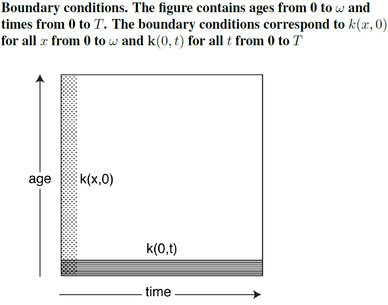
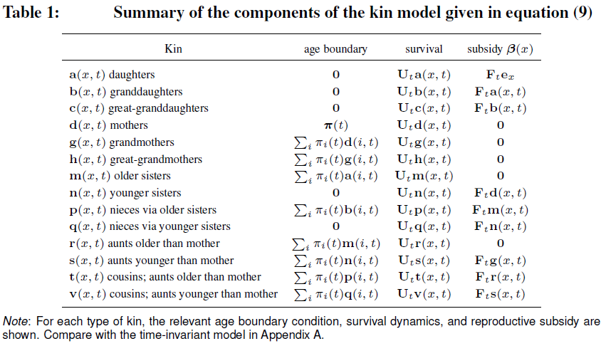
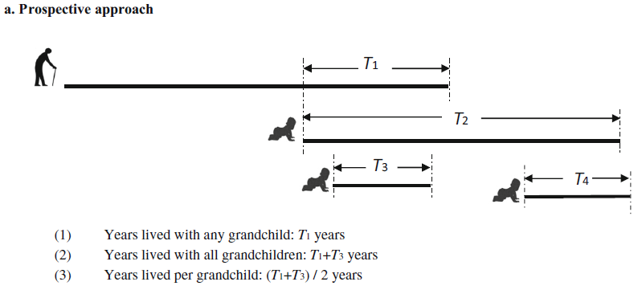

```{r setup, include=FALSE}
knitr::opts_chunk$set(echo = TRUE)
library(kableExtra)
```

#  {.tabset}

## Introduction

This website contains all the 'practical' materials for the course 'Matrix Approaches to Modelling Kinship: Theory and Applications' offered at the Max Planck Institute for Demographic Research (May 3-12 2023). 
Here, you will find some practical resources and tools for applying the theory to your own research goals.

Each day, we will have practical lab sessions in R to in which we will implement the theoretical content of the course.
This will include computing things 'by hand' (i.e., from scratch) and, later on, using the `DemoKin` package for a more convenient implementation.
The hands-on exercises will will help you understand how `DemoKin` works and give you the tools to customize the code for your own research, if needed.
In the `Setup` tab above, we have a added a brief instruction for setting things up and getting familiar with some of the functions we will be using for the practical part of the course. Please check it out!

Some useful things to know:

- The updated syllabus can be found here: https://github.com/IvanWilli/matrix_kinship_course_lab/tree/main/syllabus.
- The required readings and course's slides can be downloaded from: https://www.dropbox.com/t/iM06GB0D5fXboWYu. See guidance from Hal in the syllabus.
- Find this website's source code on GitHub: https://github.com/IvanWilli/matrix_kinship_course_lab/blob/main/docs/index.Rmd.
- Data for exercises can be found in previous dropbox folder and at https://github.com/IvanWilli/matrix_kinship_course_lab/tree/main/data.

Note that this page may *change* during the course so don't fret if you notice things moving around a bit.  We may adapt the content based on our interaction or fix bugs in the code along the way.

Please reach out to us if you have any doubts: For the next 10 days we will be a kind of *course-related-non-biological-family*!

We hope you enjoy the course and find it helpful.

Let's get to it!

Hal Caswell, Diego Alburez and Iván Williams

<!-- --------------------------------------------------------------------- -->

## Setup

### Initial settings

We will start soon the computer lab sessions, so would be great if in advance we have prepared the R environment.
First, you will need [R](https://www.r-project.org/) and [Rstudio](https://posit.co/download/rstudio-desktop/) installed.

Second, install the [DemoKin](https://github.com/IvanWilli/DemoKin) development version from GitHub (could take \~1 minute).
We made changes to the package ahead of this workshop If you had already installed the package, please uninstall it and and install it again.

```{r, eval=FALSE}
# remove.packages("DemoKin")
# install.packages("devtools")
devtools::install_github("IvanWilli/DemoKin", build_vignettes = TRUE)
```

Other packages that will be useful are:

```{r, eval=FALSE}
packages_needed <- c("tidyverse", "matrixcalc", "Matrix") 
packages_needed_nothaving <- packages_needed[!packages_needed %in% installed.packages()]
for(lib in packages_needed_nothaving) install.packages(lib,dependencies=TRUE)
```

Packages in the `tidyverse` family will be very useful for summarize and visualizing results. Please load those libraries and please contact us in case some issues came up with this topic. Packages `matrixcalc` and `Matrix` will help us with some matrix operations.

Data for examples and exercises may come from UN population estimates and projections, using the [DataPortal API](https://population.un.org/dataportal/about/dataapi) from United Nations-Population Division, or from tables located in dropbox or github.

### Operations with vector and matrix in R

The intention of this section is to introduce some basic operators of matrices and vectors, in line with appendix A of @Caswell2001. There is a lot of online resources on matrix algebra with R ([This](https://www.taylorfrancis.com/books/mono/10.1201/9781315370200/basics-matrix-algebra-statistics-nick-fieller) is a comprehensive one). Here we are going to show some relevant ones for our purposes. In case you have some experience with matrix operations in R, this won't add you too much. See @Caswell2001 for mathematical details. 

- Creation

```{r}
a_vector <- c(1, 1, 1, 1)
a_vector
```

```{r}
same_vector <- rep(1, 4) # repeat a value!
same_vector
```

The function `matrix` needs a vector and the way it should be arranged by row and col.

```{r}
a_matrix <- matrix(1:8, nrow = 4, ncol = 4)
a_matrix
```

Identity matrix, a diagonal matrix with ones in the diagonal.
```{r}
identity_matrix <- diag(1, 4)
a_matrix %*% identity_matrix == a_matrix
```

- Dimensions

For matrices and vectors is a bit different:
```{r}
# with matrix:
dim(a_matrix)

# with vectors:
# dim(a_vector) gives error. 
# Vectors in R are dimensionless, don't have a dimension by default but have a length. 
# Operationally it works as a column vector.
length(a_vector)
```

> Checking dimensions is a good practice for validating if two objects can be multiplied and in which order. You know something related to that is going on wrongly when you see this message "non-conformable arguments".

- Addition

```{r}
# needs same dimensions
other_vector <- rep(10, 4)
a_vector + other_vector
```

```{r}
other_matrix <- matrix(10, nrow = 4, ncol = 4)
a_matrix + other_matrix
```

- Multiplication

We'll use this in the *By hand* sections, and it is used a lot inside `DemoKin`. Here a very intuitive figure multiplying $A$ by $B$ (dimensions 4x2 by 2x3 gets dimension 4x3): 


You can multiply a matrix by a another matrix, a vector with another vector, or a matrix with a vector. The symbol in R is the same for multiply scalars but surrounded by `%`.

```{r}
a_matrix %*% other_matrix
a_vector %*% other_vector
a_matrix %*% a_vector
```

Don't confuse with the *Hadamard* product, the element by element operator,  which use the symbol `*`.

```{r}
a_matrix * other_matrix
a_vector * other_vector
```

- Determinant, inverse and eigendecomposition

Let's create a square *non-singular* matrix (with no zero determinant, with inverse):
```{r}
set.seed(50)
other_matrix <- matrix(rpois(25, 3), 5, 5)
```

Determinant:
```{r}
det(other_matrix)
```

Inverse:
```{r}
solve(other_matrix)
```

Eigendecomposition:
```{r}
eigen_decomposition <- eigen(other_matrix)
eigen_values <- eigen_decomposition$values
eigen_vectors <- eigen_decomposition$vectors # left ones
eigen_values
eigen_vectors
```

- System of linear equations:

Linear algebra is useful for finding a vector $x$ that pre-multiplied by $A$ produce a vector $b$, in the form of a linear system of equations $Ax=b$, finding the solution as $x=A^{-1}b$ (see @Caswell2001 for details about when this have an unique, none or infinite solutions). As an example let's solve this situation: *"I have 6 nephews and 10 nieces. My brothers have in average 1 son and 2 daughters and my sisters 1.5 sons and 2 daughters. How many brothers and sister do I have?"*. 

```{r}
b = c(6, 10) # I have 6 nephews and 10 nieces
A = matrix(c(1, 1.5, # My brother had in average 1 son and my sister 1.5
             2, 2),  # My brother had in average 2 daughters and my sister 2
          2, 2, byrow = T) # it's a 2 by 2 matrix arranged by row
x = solve(A) %*% b # vector with brothers and sisters
```

Answer: I have `r x[1]` brothers and `r x[2]` sisters. 

> During the course we will try to name vectors and matrix with one or two letters maximum, vectors with lower case and matrix with upper case. 

### `dplyr` and `tidyr`

In some exercises we will have a long table with many variables and we will need to get indicators from that, like for example the mean age of daughters when Focal is 30 yo. `dplyr` and `tidyr` packages are really good for that. Let's use `mtcars` data, getting the mean of `wt` by `cyl` and `am`, but later showing `am` categories in columns:

```{r}
head(mtcars)
```
```{r, message=F, warning=F}
library(dplyr)
library(tidyr)
mtcars %>% 
  summarise(mean_wt = mean(wt), .by = c(cyl, am)) %>% 
  pivot_wider(names_from = am, values_from = mean_wt)
```


These are the basic functions that we will use for showing examples. Check more on transforming data with [dplyr](https://dplyr.tidyverse.org/articles/programming.html) and reshaping with [tidyr](https://tidyr.tidyverse.org/articles/pivot.html) if you are curious. Finally the package [ggplot2](https://ggplot2.tidyverse.org/) will be used for visualize results. A very basic one:

```{r}
library(ggplot2)
mtcars %>% 
ggplot(aes(mpg, wt, colour = hp)) + 
  geom_point()
```

> Here, we showed you some packages and functions we like, but in the exercises you can use the tools that you want!

<!-- ---------------------------------------------------------------------- -->

## Mon 8

We will see how to translate the theory of **Age-classified time-invariant one-sex kinship models** to code, how to use `DemoKin` package for a seamless implementation, and finally do some exercises. Sections:

- [By hand](#by_hand_mon8)

- [Using DemoKin](#using_demokin_mon8)

- [Exercises](#exercises_mon8)

### By hand {#by_hand_mon8}

Imagine you are studying a female population with 5 age-classes (0 to 1, 1 to 2, ...) and fixed survival probabilities and fertility rates, given by:

```{r}
age <- 0:4
p <- c(.9, .7, .4, .1, 0)
f <- c(0, .5, .5, .3, 0)
```

Remember: each *age* is a *stage*, so age 0-1 is the stage 1, age 1-2 is the stage 2, and so on. At stage 5 (age 4+) nobody is alive ($\omega=4$ in life table applications).

> Note: we are going to use Hal's letters for naming relatives:

```{r, echo = F}
DemoKin::demokin_codes() %>% select(-1)
```

Let's build matrices $U$ and $F$. In R, the letter $F$ is reserved for `FALSE`, so we need to modify the label, in our case we choose to add a point (sorry).

```{r}
ages <- length(age)
U <- F. <- matrix(0, nrow = ages, ncol = ages)
U[row(U)-1 == col(U)] <- p[-ages]
U[ages, ages] <- p[ages] # in this case is 0
F.[1,] <- f
```

Now let's find eigenvalues and eigenvectors to calculate $w$ (the stable distribution by age) and $\pi$ (the one for the mothers).

```{r}
A = U + F.
A_eigen <- eigen(A)
A_eigen_value <- as.double(A_eigen$values[1]) # Oh! what information does it gives you?
A_eigen_vector <- as.double(A_eigen$vectors[,1])
w <- A_eigen_vector/sum(A_eigen_vector)
pi <- w * f / sum(w * f)
```

Next we are going to see how to project some relatives. For each of those we are going to create a matrix of dimension $5$ x $5$ to save the vectors of surviving kin by age (rows) in each Focal's age (columns).
So for example, living mothers by age when Focal is at age 0 will be placed in first column, living mothers by age when Focal is 1 on the second column, and so on.

- **Mother**

In the case of mothers, $\pi$ is the age distribution when Focal just born. Remember, every mother is alive a that moment, so the total (sum of $\pi$) should be 1. This vector will be placed in the first column of $D$.

```{r}
D <- matrix(0, ages, ages)
D[,1] <- pi  # eq 14 in Caswell (2019)
```

Let's project that population (here the *key*, each kin is a population) and get the living mothers at each age of Focal, preserving the age's kin too (that's why we save results in column vectors on the matrix).

```{r}
for(x in 2:ages){
  D[,x] <- U %*% D[,x-1]  # eq 13 in Caswell (2019) but in a matrix form
}
```

Each column-vector in $D$ is the vector $d(x)$ in equation 13 of @caswell_formal_2019: the distribution of living mothers by each Focal's age.

```{r}
round(D,2)
```

If we sum up by columns (marginal), we get the expected living mothers for Focal when she grows up.
```{r}
ones <- rep(1,ages)
d <- t(ones) %*% D # could be done with colSums(D)
plot(age, d, t = "b")
```

This is the general idea for all kin. Some are a bit different because includes subsidy, offspring from *other population* (other kin type), and is necessary a second term in the projection loop.

- **Daughters**

The case of relatives that born after Focal requires explicitly an additional matrix of subsidy.
Focusing on the **daughters** of Focal, initial living count by age is zero.

```{r}
A <- matrix(0, 5, 5) # eq 7 in Caswell (2019)
```

Let's project that population, adding offspring from Focal at each age (the diagonal matrix $E$ is for that purpose, is tracking Focal's age):

```{r}
E <- diag(1, ages)
for(x in 2:ages){
  A[,x] <- U %*% A[,x-1] + F. %*% E[,x-1] # eq 6 in Caswell (2019) in matrix form
}
a <- t(ones) %*% A # could be done with colSums(A)
plot(age, a, t = "b")
```

Take a moment to see how multiplication between $F$ and $E[,x]$ works.

- **Sisters**

The treatment is different depending if the sister born before or after Focal.

  - *Older* sisters: the initial distribution by age comes from the probability that Focal's mother had daughters at the time that Focal born, and then just survive (no subsidy, no new old sisters).
  - *Younger* sisters: the initial count is zero, and then the mother can bring little sisters to Focal, sisters that needs to survive with age too.

```{r}
M <- N <- matrix(0, 5, 5)
M[,1] <- A %*% D[,1] # eq 22
N[,1] <- 0           # eq 24
for(x in 2:ages){
  M[,x] <- U %*% M[,x-1]                 # eq 21
  N[,x] <- U %*% N[,x-1] + F. %*% D[,x-1]  # eq 23
}
# lets group them directly as sisters
m_n <- t(ones) %*% (M + N)
```

- **Grandmother**

What about the **grandmother**? "The age distribution of grandmothers at the birth of Focal is the age distribution of the mothers of Focal’s mother, at the age of Focal’s mother when Focal is born" (@caswell_formal_2019).

> Note: we are treating a female population in a [matrilineal](https://en.wikipedia.org/wiki/Matrilineality) framework, so Focal has only a grandmother from mother's side (female line).

In other words: What "portion" of the mother remains alive for Focal's mother when Focal born? We know that at Focal's birth there was 1 mother with age distribution $\pi$. The distribution by age of her living mother can be obtained as $D %*% \pi$.

```{r}
G <- matrix(0, 5, 5)
G[,1] <- D %*% pi
```

Take a minute to see what just happened.

Now let's project $G$ population:

```{r}
for(x in 2:ages){
  G[,x] <- U %*% G[,x-1]
}
g <- t(ones) %*% G # or colSums(G)
```

Let's visualize living kin by Focal's age for the cases computed:

```{r}
plot(age, d, t = "b", ylab = "k", ylim = c(0, 2))
lines(age, a, t = "b", col = 2)
lines(age, m_n, t = "b", col = 3)
lines(age, g, t = "b", col = 4)
legend("bottomright", c("m","d","s","gm"), col = 1:4, lty = 1)
```


That's the kinship projection essence for one-sex in the time-invariant model ($U$ and $F$ don't change), and pretty much the essence for every variant that we will see in next days.

In the `Demokin` package we have this automatized. Let's take a look on how to use it.

### Using DemoKin {#using_demokin_mon8}

First please load these libraries:

```{r, warning=FALSE, message=FALSE}
library(DemoKin)
library(dplyr)
library(tidyr)
library(ggplot2)
```

#### 1. Built-in data

The `DemoKin` package includes data from Sweden as an example. This comes from the [Human Mortality Database](https://www.mortality.org/) and [Human Fertility Database](https://www.humanfertility.org/).

This is how data of survival probabilities by age looks like:

```{r}
data("swe_px", package="DemoKin")
swe_px[1:5, 1:5]
```

It has years in columns and age in rows. Plotting $q_x$ ($´s complement) over age in a year, for example 2015, looks like this:

```{r, warning=F, message=F}
swe_px %>%
    as.data.frame() %>%
    select(px = `2015`) %>%
    mutate(ages = 1:nrow(swe_px)-1) %>%
    ggplot() +
    geom_line(aes(x = ages, y = 1-px)) +
    scale_y_log10()
```

And age-specific fertility rates:

```{r}
data("swe_asfr", package="DemoKin")
swe_asfr[26:30, 1:5]
```

Plotted over time and age:

```{r}
swe_asfr %>% as.data.frame() %>%
      as.data.frame() %>%
      select(fx = `2015`) %>%
      mutate(age = 1:nrow(swe_asfr)-1) %>%
      ggplot() +
      geom_line(aes(x = age, y = fx))
```

#### 2. The function `kin()`

`DemoKin` can be used to compute the number and age distribution of Focal's relatives under a range of assumptions, for living and deceased kin.
The function `DemoKin::kin()` currently does most of the heavy lifting in terms of implementing the models. This is what it looks like in action, in this case assuming time-invariant demographic rates of year 2015:

```{r}
# First, get vectors for a given year
swe_surv_2015 <- DemoKin::swe_px[,"2015"]
swe_asfr_2015 <- DemoKin::swe_asfr[,"2015"]
# Run kinship models
swe_2015 <- kin(p = swe_surv_2015, f = swe_asfr_2015, time_invariant = TRUE)
```

Main **arguments** are:

-   **p** numeric. A vector or matrix of survival probabilities with rows as ages (and columns as years in case of matrix).
-   **f** numeric. Same as **p** but for age-specific fertility rates.
-   **time_invariant** logical. Assume time-invariant rates. Default TRUE.
-   **output_kin** character. kin types to return: "m" for mother, "d" for daughter, ...

Other relevant argument is **birth_female**, which is set as $1/2.04$ by default. This multiplies `f` argument at some point, so in case you are using fertility rates already for female offspring only, this parameter needs to be set to 1.

Relatives for the `output_kin` argument are identified by a unique code.

> Note: relationship codes used in `DemoKin` differ from those in Caswell [-@caswell_formal_2019]. The equivalence between the two set of codes is given in the following table, so keep an eye on that in case some confusion:

```{r}
demokin_codes()
```

The output from `DemoKin::kin()` returns a list containing two data frames: `kin_full` and `kin_summary`.

```{r}
str(swe_2015)
```

-   `kin_full` : This data frame contains expected kin counts by year (or cohort), age of Focal, and age of kin. The number of rows is because we have *14 kin types*, *101 Focal ages* and *101 kin ages*.

```{r}
head(swe_2015$kin_full)
```

-   `kin_summary` : This is a 'summary' data frame derived from `kin_full`. To produce it, we sum over all ages of kin to produce a data frame of expected kin counts by year or cohort and age of Focal (but *not* by age of kin). This is how the `kin_summary` object is derived:

```{r, message=F}
kin_by_age_Focal <-
  swe_2015$kin_full %>%
  group_by(cohort, kin, age_focal) %>%
  summarise(count = sum(living)) %>%
  ungroup()
# Check that they are identical (for living kin only here)
kin_by_age_Focal %>%
  select(cohort, kin, age_focal, count) %>%
  identical(
    swe_2015$kin_summary %>%
      select(cohort, kin, age_focal, count = count_living) %>%
      arrange(cohort, kin, age_focal)
  )
```

A lot of interesting data to explore. Take a moment to interpret what information is returned in those tables. All comes from the matrices that we calculated in the *by hand* section.

Let's give more context with some possible research questions as an example.

#### 3. Example: kin counts in time-invariant populations for Sweden 2015

Following Caswell [-@caswell_formal_2019], we assume a female closed population in which everyone experiences the Swedish 2015 mortality and fertility rates at each age throughout their life. We then ask:

> How can we characterize the kinship network of an average member of the population (call her 'Focal')?

Let's use the pre-loaded Swedish data and re-run model.

```{r}
# First, get vectors for a given year
swe_surv_2015 <- DemoKin::swe_px[,"2015"]
swe_asfr_2015 <- DemoKin::swe_asfr[,"2015"]
# Run kinship model
swe_2015 <- kin(U = swe_surv_2015, f = swe_asfr_2015, time_invariant = TRUE)
```

##### 3.1. Living kin

Now, let's visualize how the expected number of daughters, siblings, cousins, etc., changes over the life-course of Focal. Use  `DemoKin::rename_kin()` with full names to identify each relative type. Some guiding questions: Why some kin increase and other decrease in first ages? Why not all types decrease in oldest ages?

```{r, fig.height=6, fig.width=8}
swe_2015$kin_summary %>%
  rename_kin() %>%
  ggplot() +
  geom_line(aes(age_focal, count_living))  +
  theme_bw() +
  labs(x = "Focal's age") +
  facet_wrap(~kin)
```

> You can think of the results as analogous to life expectancy (i.e., expected years of life for a synthetic cohort experiencing a given set of mortality rates), a period indicator. The only difference is that with $e_x$ you don't care what happened before that year, but with kinship yes (you need to give an age distribution to Focal's mother, for example).

Let's get together all previous lines in an area plot to study kin composition by age. How does overall family size (and family composition) vary over life for an average woman at each age?

```{r}
swe_2015$kin_summary %>%
  select(age_focal, kin, count_living) %>%
  rename_kin(., consolidate_column = "count_living") %>%
  ggplot(aes(x = age_focal, y = count)) +
  geom_area(aes(fill = kin), colour = "black") +
  labs(x = "Focal's age", y = "Number of living female relatives") +
  theme_bw() +
  scale_x_continuous(labels = seq(0, 100, 10), breaks = seq(0, 100, 10)) +
  theme(legend.position = "bottom")
```

Some additional questions can be formulated: is there a pick in the total? How about composition, which colors prevails in each life stage?

##### 3.2. Age distribution of living kin when Focal has some age

How old are Focal's relatives at some point's of Focal's life course? What does she see around when stops a moment of climbing over her diagonal-Lexis line? Using the `kin_full` data frame (with extended results), we can visualize the age distribution of Focal's relatives throughout Focal's life.
For example when Focal is 35, the age pattern of her relatives is:

```{r, fig.height=6, fig.width=8}
swe_2015$kin_full %>%
  DemoKin::rename_kin() %>%
  filter(age_focal == 35) %>%
  ggplot() +
  geom_line(aes(age_kin, living)) +
  geom_vline(xintercept = 35, color=2) +
  labs(y = "Expected number of living relatives") +
  theme_bw() +
  facet_wrap(~kin)
```

Is coherent the mode of each kin distribution with Focal's age? Take amoment and do this bivariate comparison by intuition reviewing each type.

If we sum-up the density for each kin we have total living kin. Let's visualize this when Focal is 35 yo in a time-invariant population using a network or 'Keyfitz' kinship diagram [@Keyfitz2005] with the `plot_diagram` function. Take a moment to see what means each value.

```{r, fig.height=10, fig.width=12}
swe_2015$kin_summary %>%
  filter(age_focal == 35) %>%
  select(kin, count = count_living) %>%
  plot_diagram(rounding = 2)
```


##### 3.3. Deceased kin

We have focused on living kin, but what about relatives who have died during her life?
The output of `kin` also includes information of kin deaths experienced by Focal. We did not see the code implementation in R, but it requires minimum additional modification to get the experienced death (basically implement equation 49 and 50 in @caswell_formal_2019, take a look to `DemoKin` in any case or ask us if you are curious).
We start by considering the number of kin deaths that can expect to experience at each age.
In other words, the non-cumulative number of deaths in the family that Focal experiences at a given age. At which age Focal would experience more kin deaths? From what types? What do you think is the reason for having *waves of bereavement*?

```{r}
swe_2015$kin_summary %>%
  filter(age_focal>0) %>%
  group_by(age_focal, kin) %>%
  summarise(count = sum(count_dead)) %>%
  ungroup() %>%
  rename_kin(., consolidate_column = "count") %>%
  ggplot(aes(x = age_focal, y = count)) +
  geom_area(aes(fill = kin), colour = "black") +
  labs(x = "Focal's age", y = "Number of kin deaths experienced at each age") +
  coord_cartesian(ylim = c(0, 0.086)) +
  theme_bw() +
  theme(legend.position = "bottom")
```

Now, we combine all kin types to show the cumulative burden of kin death for an average member of the population surviving to each age:

```{r}
swe_2015$kin_summary %>%
  group_by(age_focal, kin) %>%
  summarise(count = sum(count_cum_dead)) %>%
  ungroup() %>%
  rename_kin(., consolidate = "count") %>%
  ggplot(aes(x = age_focal, y = count)) +
  geom_area(aes(fill = kin), colour = "black") +
  labs(x = "Focal's age", y = "Number of kin deaths experienced (cumulative)") +
  theme_bw() +
  theme(legend.position = "bottom")
```

A member of the population aged 15, 50, and 65yo will have experienced, on average, this burden of death experience (considering all kin type with same weight):

```{r}
swe_2015$kin_summary %>%
  group_by(age_focal) %>%
  summarise(count = sum(count_cum_dead)) %>%
  filter(age_focal %in% c(15, 50, 65))
```

We took a look on what we can do with `DemoKin`, based in matrix implementation from Hal Caswell's paper. Let's try some exercises.

### Exercises {#exercises_mon8}

> All exercises can be completed using datasets included in DemoKin.

#### E1. Kin availability and loss

Use `DemoKin` assuming time-invariant rates from 1910 in female Swedish population, answer:

**E1.1**: What is the expected number of surviving offspring for an average woman aged 35?

```{r}
# Write your code here
swe_surv_1910 <- DemoKin::swe_px[,"1910"]
swe_asfr_1910 <- DemoKin::swe_asfr[,"1910"]
swe_1910 <- kin(p = swe_surv_1910, f = swe_asfr_1910, time_invariant = TRUE)
swe_1910$kin_summary %>%
  summarise(count_living = round(sum(count_living),3), .by = c(kin, age_focal)) %>%
  filter(age_focal == 35, kin == "d")
```

**E3.2**: What is the expected number of surviving mother for the same woman?

```{r}
# Write your code here
swe_1910$kin_summary %>%
  summarise(count_living = round(sum(count_living),3), .by = c(kin, age_focal)) %>%
  filter(age_focal == 35, kin == "m")
```

**E3.3**: Plot the 'Keyfitz' diagram for that woman and compare with the one from previous section (based on rates from year 2015).

```{r, fig.height=10, fig.width=12}
# Write your code here
swe_1910$kin_summary %>%
  filter(age_focal == 35) %>%
  select(kin, count = count_living) %>%
  plot_diagram(rounding = 2)
```

**E1.4**: What is the cumulative number of offspring deaths experienced by an average woman who survives to age 65? Compare it with the 2015 scenario creating a data frame with columns: `kin`, `loss_1910`, `loss_2015`.

```{r}
# Write your code here
swe_1910$kin_summary %>%
  summarise(count = round(sum(count_cum_dead),3), .by = c(age_focal, kin)) %>%
  rename_kin(., consolidate = "count") %>%
  filter(age_focal == 65) %>%
  rename(loss_1910 = count) %>%
  inner_join(
    swe_2015$kin_summary %>%
      summarise(count = round(sum(count_cum_dead),3), .by = c(age_focal, kin)) %>%
      rename_kin(., consolidate = "count") %>%
      filter(age_focal == 65) %>%
      rename(loss_2015 = count))
```

#### E2. Kin age distribution

Let's back to Sweden 2015. The output of `DemoKin::kin` includes information on the average age of Focal's relatives (in the columns `kin_summary$mean_age` and `kin_summary$$sd_age`). For example, this allows us to determine the mean age, standard deviation and coefficient of variation of Focal's sisters over Focal's life-course:

```{r, warning=F, message=F}
swe_2015$kin_summary %>%
  filter(kin %in% c("os", "ys")) %>%
  rename_kin() %>%
  select(kin, age_focal, mean_age, sd_age) %>%
  mutate(`sd_age/mean_age` = sd_age/mean_age) %>%
  pivot_longer(mean_age:`sd_age/mean_age`) %>%
  ggplot(aes(x = age_focal, y = value, colour = kin)) +
  geom_line() +
  facet_wrap(~name, scales = "free") +
  labs(y = "Mean age of sister(s)") +
  theme_bw()
```

Compute the mean and SD of the age of Focal's sisters over the ages of Focal **by your own** (i.e., using the raw output in `kin_full`). Plot separately (1) for younger and older sisters, (2) and for all sisters.

**E2.1**: get then mean age of living mother, daughter and sisters for a female aged 35.

```{r}
# Write your code here
mean_ages_2015 <- swe_2015$kin_full %>%
  filter(age_focal == 35) %>%
  summarise(mean_age = sum(age_kin*living)/sum(living),
            .by = c(kin))
```

**E2.2**: Do the same with rates from 1910 and compare. Think in a good way to visualize that and try it.

```{r}
# Write your code here
mean_ages_1910 <- swe_1910$kin_full %>%
  filter(age_focal == 35) %>%
  summarise(mean_age = sum(age_kin*living)/sum(living),
            .by = c(kin))
# one posible plot
mean_ages_1910 %>%
  mutate(year = 1910) %>%
  bind_rows(
    mean_ages_2015 %>% mutate(year = 2015)) %>%
  ggplot() +
  geom_bar(aes(kin, mean_age, fill=factor(year)),
           stat = "identity", position = "dodge")
```

**E2.3**

The 'Sandwich Generation' refers to persons who are squeezed between frail older parents and young dependent children and are assumed to have simultaneous care responsibilities for multiple generations, potentially limiting their ability to provide care [-@alburezgutierrez_sandwich_2021].
For this exercise, we consider an individual to be 'sandwiched' if they have at least one child aged $15$ or younger and a mother older than $75$ (actually in the paper this age $a$ is the one that makes $e_a=5$). Use `DemoKin` to find at which age Focal is more *sandwiched* in 2015, assuming time-invariant rates and a female-only population.

#### E3. By hand calculation

**E3.1**: use vectors $p$ and $f$ from the toy example in *By Hand* section, but this time with `DemoKin`. Do you have the same results? How many grandmothers have Focal during her life?

```{r}
by_hand_example <- kin(p, f, birth_female = 1)
# some checks
by_hand_example$kin_summary %>% filter(kin == "gm") %>% pull(count_living) == g
by_hand_example$kin_summary %>% filter(kin == "m") %>% pull(count_living) == d
by_hand_example$kin_summary %>% filter(kin == "d") %>% pull(count_living) == a
# grandmothers
by_hand_example$kin_summary %>% filter(kin == "gm") %>% pull(count_living)
```


## Tues 9

Here, we will implement the theory of Age-classified time-**variant** one-sex kinship models in R, show how to use the `DemoKin` package for that goal, and do some exercises.

- [By hand](#by_hand_tues9)

- [Using DemoKin](#using_demokin_tues9)

- [Exercises](#exercises_tues9)

### By hand {#by_hand_tues9}

Let's keep studying our female closed population with 5 age-classes, but now we know that in the next 9 years ($T=9$) the probability of death will decline 1% yearly for all age-classes. Fertility rates will also decline by 1% each year. We use $Pt$ and $Ft$ for create matrices with time varying rates (time in columns and age in rows).

```{r}
age <- 0:4
ages <- length(age)
T. <- 9 # again T is reserved for logical TRUE value, so we add a point
years <- length(0:T.)
p <- c(.9, .7, .4, .1, 0)
Pt <- 1 - sapply(0:T., function(t) (1-p)*(.99)^t)
f <- c(0, .5, .5, .3, 0)
Ft <- sapply(0:T., function(t) f *(.99)^t)
plot(0:T., colSums(Ft), xlab = "t", ylab = "GRR") # we are dealing with female offspring only
plot(0:T., colSums(Pt)+.5, xlab = "t", ylab = "e(0)") # an approximation of e(0) when a(x)=.5
```

Those matrices are not convenient for projection purposes: for this we would need transition matrices. Let's create two lists with time dependent matrices for survival and fertility, called $Ut\_list$ and $Ft\_list$. We will come back to these soon.

```{r}
Ut_list <- list() # eq 6 Caswell (2021)
Ft_list <- list() # eq 7 Caswell (2021)
U_temp <- F_temp <- matrix(0, ages, ages)
for(t in 1:years){
  # create matrices
  U_temp[row(U_temp)-1 == col(U_temp)] <- Pt[-ages,t]
  F_temp[1,] <- Ft[,t]
  # save as element
  Ut_list[[t]] <- U_temp
  Ft_list[[t]] <- F_temp
}
# see survival matrix at t=1 (second element)
Ut_list[[2]]
```

In this case we have a vector of female population `pop` at the beginning of the period, so we can project this and calculate empirical mother's distribution by age for that year and next the ones:

```{r}
# initial population count
pop <- c(300, 250, 100, 15, 0)
# distribution by age
z <- pop / sum(pop)
# project population Z and get pi at each year
Z <- Pi <- matrix(0, ages, years)
Z[,1] <- z
Pi[,1] <- Z[,1] * Ft[,1] / sum(Z[,1] * Ft[,1])
for(t in 1:T.){
  At <- Ut_list[[t]] + Ft_list[[t]]
  Z[,t+1] <- At %*% Z[,t] # eq 13 Caswell (2021)
  Pi[,t+1] <- Z[,t+1] * Ft[,t+1] / sum(Z[,t+1] * Ft[,t+1]) # eq 14 Caswell (2021)
}
plot(0:T., colSums(Z), ylab = "%pop", xlab = "t")
```

Basically this is what we are going to do for kinship *populations*: make dynamic matrices by time with those lists.

For each kin we need to define the initial snapshot by age at time 0 $k(x,0)$ (*time boundary*), and what is the initial kin availability for Focal born on next $T$ years (eq. 15 and 16 from @caswell_formal_2021).



- **Mother**

One solution to the time boundary restriction comes with assuming a stable population behavior before $t=0$: every Focal has living kin with the pattern by age that we saw in time-invariant method. What would be another solution?

The solution to the age boundary will come from taking the empirical $\pi(t)$ at each time (also stable assumption can be done in case no observed data is available, but is not the same). And that's the reason why we saved $\pi$ for all the years.

Let's start with the base year $t=0$, define a list that will save mothers by age (rows) and Focal's age (cols) in each year, as we did in the previous day, and assign the distribution that comes from stable assumption:

```{r}
Dt_list <- list()
D0 <- matrix(0, ages, ages)
D0[,1] <- Pi[,1] # from stable assumption
for(x in 2:ages){
  D0[,x] <- Ut_list[[1]] %*% D0[,x-1] # look that we are using akways the base year
}
```

> As with age classes, try to not confuse $t$ value with the order of elements in the list: for $t=0$ is the first element, for $t=1$ is the second..., for $t=9$ is the tenth.

So this is the initial snapshot of mothers by age of Focal in base year. Every average woman by age in that year experimented what Focal did in the time-invariant scenario.

```{r}
plot(age, D0[,1], t = "b",ylab = "Mother by focal age in base year")
for(x in 2:ages){
  lines(age, D0[,x], t = "b", col = x)
}
legend("topright", c("0","1","2","3","4"), col = 1:5, lty = 1)
```

Let's project over time. Create a list for saving each $Dt$ matrix of living mothers at each year:

```{r}
Dt_list[[1]] <- D0
```

After 1 year, the mother of each Focal will survive, and new Focals (just born) will have mothers with $\Pi(t+1)$ distribution:

```{r}
# D1 for t=1
D1 <- matrix(0, ages, ages)
D1[,1] <- Pi[,1]
for(x in 2:ages){
  D1[,x] <- Ut_list[[1]] %*% D0[,x-1] # we look the distribution in the previous year
}
Dt_list[[2]] <- D1
```

After 1 more year...

```{r}
# D2 for t=2
D2 <- matrix(0, ages, ages)
D2[,1] <- Pi[,2]
for(x in 2:ages){
  D2[,x] <- Ut_list[[2]] %*% D1[,x-1] # we look the distribution in the previous year
}
Dt_list[[3]] <- D2
```

At the end we will have living mothers by age for each Focal's age, at each year:

```{r, eval = F}
for(t in 3:years){
Dt <- matrix(0, 5, 5)
Dt[,1] <- Pi[,t]  # eq 32 in Caswell (2021)
  for(x in 2:ages){
    Dt[,x] <- Ut_list[[t]] %*% Dt_list[[t-1]][,x-1] # eq 31 in Caswell (2021)
  }
Dt_list[[t]] <- Dt
}
```

> Consider that we are creating a series of Focal's cohorts: at each year $t$ we have 5 Focals, one at each age-class with living kin distribution by age and type that depends of experienced rates.

Let's bind results in a table, so we can see what we have.

```{r}
D_table <-lapply(1:length(Dt_list), function(t){
   data.frame(age_focal = age, year = t-1, count_living = colSums(Dt_list[[t]]))}) %>%
  dplyr::bind_rows()
```

We have a table with 250 rows (5 age-classes of Focal by 10 years by 5 age-classes of mother), with living mothers by focal's age, in each year, depending kin's age, which allows analysis in APC dimensions (section 2.2 in @caswell_formal_2021). This is pretty similar to what `Demokin` give us as output in `kin_full` data frame.

Similar reasoning follows other kin types. Time boundary comes from time-invariant assumption, and age boundary comes from using $\pi(t)$ at each year and relates that with kin distribution in the same time. For example, grandmothers for a newborn in $t=3$ will be `Dt_list[[3]] %*% \Pi[,3]`, which in terms of table 1 from @caswell_formal_2021 is $\sum_{i}{\pi_i(t)d(i,t)}$, a vectorized form with ages $i$.



Let's play with real data!

### Using DemoKin {#using_demokin_tues9}

#### 1. Living kin

We saw yesterday the case of Sweden in 2015 assuming constant rates. But the demography of Sweden is, as you know, changing every year. This means that Focal and her relatives will have experienced changing mortality and fertility rates over time. Data has year in columns and age in rows, and plotted $q_x$ (p's complement) over age and time, looks like this:

```{r}
data("swe_px", package="DemoKin")
swe_px %>%
    as.data.frame() %>%
    mutate(age = 1:nrow(swe_asfr)-1) %>%
    pivot_longer(-age, names_to = "year", values_to = "px") %>%
    mutate(qx = 1-px) %>%
    ggplot() +
    geom_line(aes(x = age, y = qx, col = year)) +
    scale_y_log10() +
    theme(legend.position = "none")
```

Age-specific fertility rates:

```{r}
data("swe_asfr", package="DemoKin")
swe_asfr %>% as.data.frame() %>%
     mutate(age = 1:nrow(swe_asfr)-1) %>%
     pivot_longer(-age, names_to = "year", values_to = "asfr") %>%
     mutate(year = as.integer(year)) %>%
     ggplot() + geom_tile(aes(x = year, y = age, fill = asfr)) +
     scale_x_continuous(breaks = seq(1900,2020,10), labels = seq(1900,2020,10))
```

And female population by age:

```{r}
data("swe_pop", package="DemoKin")
swe_pop %>% as.data.frame() %>%
     mutate(age = 1:nrow(swe_asfr)-1) %>%
     pivot_longer(-age, names_to = "year", values_to = "pop") %>%
     mutate(year = as.integer(year)) %>%
     ggplot() + geom_tile(aes(x = year, y = age, fill = pop)) +
     scale_x_continuous(breaks = seq(1900,2020,10), labels = seq(1900,2020,10))
```

We account for this, by using the time-variant models introduced by @caswell_formal_2021. Let's take a look at the resulting kin counts for a Focal born in 1960, limiting the output to the relative types given in the argument `output_kin`.

```{r, fig.height=6, fig.width=8}
swe_time_varying_1960_cohort <-
  kin(
    p = swe_px,
    f = swe_asfr,
    n = swe_pop,
    time_invariant =FALSE,
    output_cohort = 1960,
    output_kin = c("d","gd","ggd","m","gm","ggm")
    )

# plot
swe_time_varying_1960_cohort$kin_summary %>%
  DemoKin::rename_kin() %>%
  ggplot(aes(age_focal,count_living)) +
  geom_line()+
  scale_y_continuous(name = "",labels = seq(0,3,.2),breaks = seq(0,3,.2))+
  labs(y = "Expected number of living relatives") +
  facet_wrap(~kin,scales = "free")+
  theme_bw()
```

These are the living kin that expects to have an average woman born in 1960, given experienced fertility, mortality and population distribution since 1900 to 2018. Here it is important to distinguish between time boundary restriction and cohort year: with `output_cohort = 1960` we are sub-setting a Focal cohort (a diagonal) from all possible results (101 age-classes and 119 years). Estimates stop at age 58 because of input restriction up to 2018.

> Actually `DemoKin` can not return all APC combinations because of time/memory performance issues related to the size of data (119 X 101 x 101 x 14 ~ 17 millions of rows). We are evaluating only return `kin_summary` in this cases (this limitation could be a programming skills limitation too ;)).

But also we can compare cohorts, for example against 1910`s one. Take a time to interpret results (table and plot).

```{r, fig.height=6, fig.width=8}
swe_time_varying_1960_1910_cohort <-
  kin(
    p = swe_px,
    f = swe_asfr,
    n = swe_pop,
    time_invariant =FALSE,
    output_cohort = c(1910, 1960),
    output_kin = c("d","gd","ggd","m","gm","ggm")
    )

# plot
swe_time_varying_1960_1910_cohort$kin_summary %>%
  DemoKin::rename_kin() %>%
  ggplot(aes(age_focal,count_living,color=factor(cohort))) +
  geom_line()+
  scale_y_continuous(name = "",labels = seq(0,3,.2), breaks = seq(0,3,.2))+
  labs(y = "Expected number of living relatives") +
  facet_wrap(~kin, scales = "free")+
  theme_bw()
```

Maybe you are interested in take a snapshot of kin distribution in some year, for example 1990, setting argument`output_period = 1990`. What can you describe and not with this period approach, and what with the cohort approach?

```{r, fig.height=6, fig.width=8}
swe_time_varying_1990_period <-
  kin(
    p = swe_px,
    f = swe_asfr,
    n = swe_pop,
    time_invariant =FALSE,
    output_period = 1990,
    output_kin = c("d","gd","ggd","m","gm","ggm")
    )

# plot
swe_time_varying_1990_period$kin_summary %>%
  DemoKin::rename_kin() %>%
  ggplot(aes(age_focal,count_living)) +
  geom_line() +
  scale_y_continuous(name = "",labels = seq(0,3,.2),breaks = seq(0,3,.2))+
  labs(y = "Expected number of living relatives") +
  facet_wrap(~kin,scales = "free")+
  theme_bw()
```

#### 2. Kin deaths

Kin loss can have severe consequences for bereaved relatives. It can also affect the provision of care support and intergenerational transfers over the life course.
The function `kin` also includes information on the number of relatives lost by Focal during her life, stored in the column `count_cum_death`. Let's follow with the cohort comparison: what types looks with the biggest differences? See absolute and relative terms (scale in this grid plots can be confusing some times)?

```{r, fig.height=6, fig.width=8, message=FALSE, warning=FALSE, eval=F}
swe_time_varying_1960_1910_cohort$kin_summary %>%
  DemoKin::rename_kin() %>%
  ggplot() +
  geom_line(aes(age_focal, count_cum_dead, col = factor(cohort))) +
  labs(y = "Expected number of deceased relatives") +
  theme_bw() +
  facet_wrap(~kin,scales="free")
```

Given these population-level measures, we can compute Focal's mean age at the time of her relative's death. For a Focal aged 50 yo, what kind of conclusions can you get?

```{r}
swe_time_varying_1960_1910_cohort$kin_summary %>%
  rename_kin() %>%
  filter(age_focal == 50) %>%
  select(kin,cohort,mean_age_lost) %>%
  pivot_wider(names_from = cohort, values_from = mean_age_lost) %>%
  mutate_if(is.numeric, round, 1)
```

### Exercises {#exercises_tues9}

**E.1** Thanks to [DataPortal API](https://population.un.org/dataportal/about/dataapi#tutorial-using-r) from UN we can download estimated rates from any country in the world, produced by the [World Population Prospects](https://population.un.org/wpp/) project. Pick any country (feel free to pick at random or choose that one that you are interesting) and download the data with the function `get_UNWPP_inputs` (located at same folder than with this *Rmd*,  [here](https://github.com/IvanWilli/matrix_kinship_course_lab/tree/main/docs)).

```{r}
# load function
source("get_UNWPP_inputs.R")

# pick country
country <- c("Argentina")

# Year range
my_startyr   <- 1950
my_endyr     <- 2021

# data downloaded
data <- get_UNWPP_inputs(
  countries = country, 
  my_startyr = my_startyr, 
  my_endyr = my_endyr
  )

# reshape fertility
country_fert <- data %>%
  select(age, year, fx) %>%
  pivot_wider(names_from = year, values_from = fx) %>%
  select(-age) %>%
  as.matrix()
```

**E.1.1** Reshape data for survival in the same way and visualize it.

```{r}
# reshape survival
country_surv <- data %>%
  select(age, year, px) %>%
  pivot_wider(names_from = year, values_from = px) %>%
  select(-age) %>%
  as.matrix()
country_surv %>%
    as.data.frame() %>%
    mutate(age = 1:nrow(swe_asfr)-1) %>%
    pivot_longer(-age, names_to = "year", values_to = "px") %>%
    mutate(qx = 1-px) %>%
    ggplot() +
    geom_line(aes(x = age, y = qx, col = year)) +
    scale_y_log10() +
    theme(legend.position = "none")

```

**E.1.2** Run a time-variant model for your country, selecting years 1950 and 2015 from a period perspective. Focusing in Focal's ages 50, compare both years in terms of total living kin and and mean age and extract two or three findings.

```{r}
E.1.2 <-
  kin(
    p = country_surv,
    f = country_fert,
    time_invariant =FALSE,
    output_period = c(1990, 2015),
    output_kin = c("d","gd","ggd","m","gm","ggm")
    )

E.1.2$kin_summary %>%
  DemoKin::rename_kin() %>%
  ggplot(aes(age_focal,count_living,color=factor(year))) +
  geom_line() +
  labs(y = "Expected number of living relatives") +
  facet_wrap(~kin,scales = "free")+
  theme_bw()
```

**E.1.2** Run a time-variant model for your country selecting cohort 1990. If we assume that each kin lives all the interval and dies (if does) at the end of the year, this means that each lived year by each kin was a "shared" one, so you can sum kin availability and get an approximation of accumulated person-years. Estimate the amount of sister-years shared for Focal at age 30, for older and younger sisters. 

> Take a look to the graphic from @Song2019, we are in the definition 2 of years lived but with a simpler approach for sisters in our case.


```{r}
E.1.3 <-
  kin(
    p = country_surv,
    f = country_fert,
    time_invariant =FALSE,
    output_cohort = c(1990),
    output_kin = c("os", "ys")
    )

# E.1.3$kin_summary %>%
#   DemoKin::rename_kin() %>%
#   ggplot(aes(age_focal,count_living)) +
#   geom_line() +
#   labs(y = "Expected number of living relatives") +
#   facet_wrap(~kin)+
#   theme_bw()

E.1.3$kin_summary %>% 
  group_by(kin, cohort) %>% 
  mutate(shared_years = cumsum(count_living)) %>% 
  filter(age_focal == 30) %>% 
  group_by(cohort, kin) %>% 
  summarise(sister_years =sum(shared_years))
```


**E.1.4** Covid pandemic had a big impact in kin bereavement in some countries (@verdery_tracking_2020; @Snyder2022). If you make an scenario replacing 2020 and 2021 survival probabilities by the ones from 2019 (a baseline, could be averaging some previous too), maybe you can have a sense of Covid19 impact in kin bereavement, for example for the 1960 cohort. Give a try, calculating the difference between living older kin for a female aged 50 in the two scenarios. But! We recommend to take a look on excess mortality implied in survival pattern to know in advance the magnitude of the shock you can expect. 

```{r}
country_surv_counterfactual <- country_surv
country_surv_counterfactual[,"2020"] <- country_surv_counterfactual[,"2019"]
country_surv_counterfactual[,"2021"] <- country_surv_counterfactual[,"2019"]

E.1.4 <-
  kin(
    p = country_surv,
    f = country_fert,
    time_invariant =FALSE,
    output_period = c(2021)
    )
E.1.4_counterfactual <-
  kin(
    p = country_surv_counterfactual,
    f = country_fert,
    time_invariant =FALSE,
    output_period = c(2021)
    )

c(E.1.4$kin_full %>% 
  summarise(all_kin = sum(living[age_focal == 50 & age_kin>50])),
E.1.4_counterfactual$kin_full %>% 
  summarise(all_kin = sum(living[age_focal == 50 & age_kin>50]))
)

```

E.3 Run the toy example with DemoKin and check if you have the same results for type *mother* (the one that we coded in that section). To make it work you need first to add row names (age) and column names (years) to $Pt$ and $Ft$.

```{r}
rownames(Pt) <- rownames(Ft) <- rownames(Pi) <- 0:4
colnames(Pt) <- colnames(Ft) <- colnames(Ft) <- 0:9
by_hand_example <- kin(p = Pt, f = Ft, pi = Pi, time_invariant = FALSE, birth_female = 1)
by_hand_example

D_table
by_hand_example$kin_summary %>%
  filter(kin == "m") %>%
  summarise(living = sum(count_living), .by = c(year, age_focal)) %>%
  arrange(year, age_focal)
```


## Wed 10

During this section, we will implement the theory of Age-classified time-**invariant** **two**-sex kinship models In R, use `DemoKin` package and do some exercises.

- [By hand](#by_hand_wed10)

- [Using DemoKin](#using_demokin_wed10)

- [Exercises](#exercises_wed10)

### By hand {#by_hand_wed10}

Now our population has two sex, each of them has its own mortality and fertility pattern by age, given by:

```{r}
age <- 0:4
# female
p_female <- c(.9, .7, .4, .1, 0)
f_female <- c(0, .5, .5, .3, 0)
# female
p_male <- c(.9, .6, .3, .05, 0) # higher mortality
f_male <- f_female * seq(1, 1.1, length.out = 5) # increase a bit level and mean age
plot(age, f_male, t="b", col = 4, ylab = "Parents distribution by age in the 2-sex stable population")
lines(age, f_female, t="b", col = 2)
legend("topright", c("males","females"), col=c(4,2), lty = 1)
```

Let's build the survival and fertility matrices $U$ and $F$ for each sex.

```{r}
ages <- length(age)
# female
U_female <- F_female <- matrix(0, nrow=ages, ncol=ages)
U_female[row(U_female)-1 == col(U_female)] <- p_female[-ages]
U_female[ages, ages] <- p_female[ages]
F_female[1,] = f_female
# male
U_male = F_male = matrix(0, nrow=ages, ncol=ages)
U_male[row(U_male)-1 == col(U_male)] <- p_male[-ages]
U_male[ages, ages] = p_male[ages]
F_male[1,] = f_male
```

@caswell_formal_2021 suggests to mix female and male patterns in a block matrices  $Ub$ and $Fb$ (or $\tilde{U}$ and $\tilde{F}$in the paper), which let us to project a population vector with first 5 elements with female population by age and last 5 for males by age (a block-structured vector, see eq. 16 in @caswell_formal_2022).

`Matrix` package will help us to construct those block matrices (the function `bdiag` returns a [sparse](https://en.wikipedia.org/wiki/Sparse_matrix) matrix, so need to get back to a common matrix).

```{r}
alpha <- .5 # portion of males among offspring ()
Ub <- Matrix::bdiag(U_female, U_male) %>% as.matrix() # Ub in eq 9 Caswell (2021)
Fb <- rbind(cbind(alpha * F_female,      alpha * F_male), # Fb in eq 9 Caswell (2021)
            cbind((1-alpha) * F_female, (1-alpha) * F_male))
Ab <- Ub + Fb
```

> We are in a scenario where survival and fertility don't depend of line of descendence (itis the same for a grandson that comes from daughters than from sons). The same is true for grandmothers: we won't keep track if she is the father's or mother's mom. This is done to simplify matrix calculation. You can change it according to your research question.

Let's project some fictitious population to see how block-structured matrices and vectors works:

```{r}
set.seed(100)
pop_females <- rpois(5, 100)
pop_males <- rpois(5, 100)

# block str vector
popb <- c(pop_females, pop_males)

# project
pop_proj <- Ab %*% popb # still a cycle graph conected
pop_proj
```

The positions 1 and 6 in vector `pop_proj` corresponds to new offspring, and are equal because no matter how many new individuals comes from male fertility and how many from female fertility, all are split by `$\alpha$`. This was how to project a 2-sex population. 

Now let's find stable distribution by age $w$, and then the ones for parents $pi$, for each sex:

```{r}
A_eigen = eigen(Ab)
A_eigen_value = as.double(A_eigen$values[1])
A_eigen_vector = as.double(A_eigen$vectors[,1])
w_female = A_eigen_vector[1:ages]
w_male = A_eigen_vector[c((ages+1):(ages*2))] # remember sex position
pi_female = w_female * f_female / sum(w_female * f_female)
pi_male = w_male * f_male / sum(w_male * f_male)
pib <- c(pi_female, pi_male)
plot(age, pi_male, t="b", col = 4, ylab = "Parents distribution by age in the 2-sex stable population")
lines(age, pi_female, t="b", col = 2)
legend("topright", c("males","females"), col=c(4,2), lty = 1)
```

- **Mother**

We have the age distribution of parents when Focal born $\tilde{d}(0)=\tilde{\pi}$ (eq 44), `pib` in our code, which is the initial distribution when Focal is born (so first column of `Db`), and we need to project them as we did with the fictitious population. 

```{r}
# project mothers
Db <- matrix(0, ages*2, ages)
Db[,1] <- pib # eq 44 in Caswell (2022)
for(x in 2:ages){
  Db[,x] <- Ub %*% Db[,x-1] # eq 43 in Caswell (2022)
}

# we can calculate total parents
ones = rep(1,ages*2) # row vector by deafult
db <- ones %*% Db

# or sex-specific
ones = rep(1,ages) # row vector by deafult
db_mothers <- ones %*% Db[1:ages,]
db_fathers <- ones %*% Db[-(1:ages),]

# how many living fathers and mothers has Focal during her life
plot(age, db_fathers, t = "b", col = 4, xlab = "d")
lines(age, db_mothers, t = "b", col = 2)
legend("topright", c("father","mother"), col = c(4,2), lty = 1)
```

> Arranging in a convenient way matrices and vectors made calculations equal to the one sex model!

- **Children**

For projecting children we need a modified version of $E$ from the one-sex variant, tracking the age of Focal in a block-structured vector: we call $Phi$ (eq. 34). Because Focal is a female she starts in position [1,1] (if not he would start in [6,1]). The matrix $Gb$ moves Focal with age with subdiagonal depending also of Focal`s sex.

```{r}
Phi <- matrix(0, ages*2, ages)
Phi[1, 1] <- 1 
# G matrix moves Focal by age
G <- matrix(0, ages, ages)
G[row(G)-1 == col(G)] <- 1
Gb <- Matrix::bdiag(G, matrix(0, ages, ages)) %>% as.matrix()
```

Remember that for children we use $Fb$, so all daughters comes from Focal line. 

```{r}
# inital
Ab <- matrix(0, ages*2, ages) # eq 36
for(x in 2:ages){
  Ab[,x]  = Ub %*% Ab[,x-1] + Fb %*% Phi[,x-1] # eq 35
  Phi[,x] = Gb %*% Phi[,x-1]
}
ones <- rep(1,5)
a_daughter <- ones %*% Ab[1:ages,]
a_son <- ones %*% Ab[-(1:ages),]

# how many living son and daughter has Focal during her life
plot(age, a_daughter, t = "b", col=2)
lines(age, a_son, t = "b", col = 4)
legend("topleft", c("daughter","son"), col = c(2, 4), lty = 1)
```


Continuing with other kin has the same logic than the one-sex model but with block-structured vectors and matrices but with two exceptions. For the case of descendants we need to assign births to one of the parents, because if not we would be counting twice young siblings, for example (fertility rates are independent between sex). By convention is assigned to the mother, replacing male fertility from $\tilde{F}$ for $\tilde{F}^*$ (eq 57). The other exception is that for ancestors, $\pi$ is the sum of female and male distribution, due to the no identification of grandparents by sex from which parent line. See table from @caswell_formal_2022 for a summary.

[Caswell (2022)](time_inv_2sex_summary.png)

### Using DemoKin {#using_demokin_wed10}

Human males generally live longer and reproduce later than females.
These sex-specific processes affect kinship dynamics in a number of ways.
For example, the degree to which an average member of the population, call her Focal, has a living grandparent is affected by differential mortality affecting the parental generation at older ages.
We may also be interested in considering how kinship structures vary by Focal's sex: a male Focal may have a different number of grandchildren than a female Focal given differences in fertility by sex.
Documenting these differences matters since women often face greater expectations to provide support and informal care to relatives.
As they live longer, they may find themselves at greater risk of being having no living kin.
The function `kin2sex` implements two-sex kinship models as introduced by Caswell (2022).
This vignette show how to run two-sex models and highlights some of the advantages of this model over one-sex models in populations with time-invariant and time-variant rates.

```{r, message=FALSE, warning=FALSE}
library(DemoKin)
library(tidyr)
library(dplyr)
library(ggplot2)
library(knitr)
```

#### 1. Demographic rates by sex

Data on female fertility by age is less common than female fertility. Schoumaker (2019) shows that male TFR is almost always higher than female Total Fertility Rates (TFR) using a sample of 160 countries.
For this example, we use data from 2012 France to exemplify the use of the two-sex function.
Data on female and male fertility and mortality are included in `DemoKin`. In this population, male and female TFR is almost identical (1.98 and 1.99) but the distributions of fertility by sex varies over age:

```{r}
fra_fert_f <- fra_asfr_sex[,"ff"]
fra_fert_m <- fra_asfr_sex[,"fm"]
fra_surv_f <- fra_surv_sex[,"pf"]
fra_surv_m <- fra_surv_sex[,"pm"]

sum(fra_fert_m)-sum(fra_fert_f)

data.frame(value = c(fra_fert_f, fra_fert_m, fra_surv_f, fra_surv_m),
           age = rep(0:100, 4),
           sex = rep(c(rep("f", 101), rep("m", 101)), 2),
           risk = c(rep("fertility rate", 101 * 2), rep("survival probability", 101 * 2))) %>%
  ggplot(aes(age, value, col=sex)) +
  geom_line() +
  facet_wrap(~ risk, scales = "free_y") +
  theme_bw()
```

#### 2. Time-invariant two-sex kinship models

We now introduce the functions `kin2sex`, which is similar to the one-sex function `kin` (see `?kin`) with two exceptions.
First, the user needs to specify mortality and fertility by sex.
Second, the user must indicate the sex of Focal (which was assumed to be female in the one-sex model).
Let us first consider the application for time-invariant populations:

```{r}
kin_result <- kin2sex(
  pf = fra_surv_f,
  pm = fra_surv_m,
  ff = fra_fert_f,
  fm = fra_fert_m,
  time_invariant = TRUE,
  sex_focal = "f",
  birth_female = .5
  )
```

The output of `kin2sex` is equivalent to that of `kin`, except that it includes a column `sex_kin` to specify the sex of the given relatives.

Let's group aunts and siblings to visualize the number of living kin by Focal's age.

```{r, message=FALSE, warning=FALSE}
kin_out <- kin_result$kin_summary %>%
  mutate(kin = case_when(kin %in% c("s", "s") ~ "s",
                         kin %in% c("ya", "oa") ~ "a",
                         T ~ kin)) %>%
  filter(kin %in% c("d", "m", "gm", "ggm", "s", "a"))

kin_out %>%
  group_by(kin, age_focal, sex_kin) %>%
  summarise(count=sum(count_living)) %>%
  ggplot(aes(age_focal, count, fill=sex_kin))+
  geom_area()+
  theme_bw() +
  facet_wrap(~kin)
```

**A note on terminology**

The function `kin2sex` uses the same codes as `kin` to identify relatives (see `demokin_codes()`).
Note that when running a two-sex model, the code 'm' refers to either mothers or fathers!
Use the column `sex_kin` to determine the sex of a given relatives.
For example, in order to consider only sons and ignore daughters, use:

```{r}
kin_result$kin_summary %>%
  filter(kin == "d", sex_kin == "m") %>%
  head()
```

Information on kin availability by sex allows us to consider sex ratios, a traditional measure in demography, with females often in denominator. The following figure, for example, shows that a 25yo French woman in our hypothetical population can expect to have 0.5 grandfathers for every grandmother:

```{r, message=FALSE, warning=FALSE}
kin_out %>%
  group_by(kin, age_focal) %>%
  summarise(sex_ratio=sum(count_living[sex_kin=="m"], na.rm=T)/sum(count_living[sex_kin=="f"], na.rm=T)) %>%
  ggplot(aes(age_focal, sex_ratio))+
  geom_line()+
  theme_bw() +
  facet_wrap(~kin, scales = "free")
```

The experience of kin loss for Focal depends on differences in mortality between sexes.
A female Focal starts losing fathers earlier than mothers.
We see a slightly different pattern for grandparents since Focal's experience of grandparental loss is dependent on the initial availability of grandparents (i.e. if Focal's grandparent died before her birth, she will never experience his death).

```{r, message=FALSE, warning=FALSE}
# sex ratio
kin_out %>%
  group_by(kin, sex_kin, age_focal) %>%
  summarise(count=sum(count_dead)) %>%
  ggplot(aes(age_focal, count, col=sex_kin))+
  geom_line()+
  theme_bw() +
  facet_wrap(~kin)
```

#### 3. Time-variant two-sex kinship models

We look at populations where demographic rates are not static but change on a yearly basis.
For this, we consider the case of Sweden using data pre-loaded in `DemoKin`.
For this example, we will create 'pretend' male fertility rates by slightly perturbing the existing female rates.
This is a toy example, since a real two-sex model should use actual female and male rates as inputs.

```{r}
years <- ncol(swe_px)
ages <- nrow(swe_px)
swe_surv_f_matrix <- swe_px
swe_surv_m_matrix <- swe_px ^ 1.5 # artificial perturbation for this example
swe_fert_f_matrix <- swe_asfr
swe_fert_m_matrix <- rbind(matrix(0, 5, years),
            swe_asfr[-((ages-4):ages),]) * 1.05 # artificial perturbation for this example

par(mfrow=c(1,2))
plot(swe_surv_f_matrix[,"1900"], t="l", xlab = "Age", ylab = "Survival probability")
lines(swe_surv_m_matrix[,"1900"], col=2)
plot(swe_fert_f_matrix[,"1900"], t="l", xlab = "Age", ylab = "Fertility rate")
lines(swe_fert_m_matrix[,"1900"], col=2)
```

We now run the time-variant two-sex models (note the `time_invariant = FALSE` argument):

```{r}
kin_out_time_variant <- kin2sex(
                      pf = swe_surv_f_matrix,
                      pm = swe_surv_m_matrix,
                      ff = swe_fert_f_matrix,
                      fm = swe_fert_m_matrix,
                      sex_focal = "f",
                      time_invariant = FALSE,
                      birth_female = .5,
                      output_cohort = 1900
                      )
```

We can plot data on kin availability alongside values coming from a time-invariant model to show how demographic change matters: the time-variant models take into account changes derived from the demographic transition, whereas the time-invariant models assume never-changing rates.

```{r, message=FALSE, warning=FALSE}
kin_out_time_invariant <- kin2sex(
                      swe_surv_f_matrix[,"1900"], swe_surv_m_matrix[,"1900"],
                      swe_fert_f_matrix[,"1900"], swe_fert_m_matrix[,"1900"],
                      sex_focal = "f", birth_female = .5)


kin_out_time_variant$kin_summary %>%
  filter(cohort == 1900) %>% mutate(type = "variant") %>%
  bind_rows(kin_out_time_invariant$kin_summary %>% mutate(type = "invariant")) %>%
  mutate(kin = case_when(kin %in% c("ys", "os") ~ "s",
                         kin %in% c("ya", "oa") ~ "a",
                         T ~ kin)) %>%
  filter(kin %in% c("d", "m", "gm", "ggm", "s", "a")) %>%
  group_by(type, kin, age_focal, sex_kin) %>%
  summarise(count=sum(count_living)) %>%
  ggplot(aes(age_focal, count, linetype=type))+
  geom_line()+ theme_bw() +
  facet_grid(cols = vars(kin), rows=vars(sex_kin), scales = "free")
```

The assignment should be completed in groups that will be defined at the start of the course. **Make sure to read the instructions for the assignment in the syllabus:** https://github.com/alburezg/EDSD_2023_kinship_demography/EDSD_2023_kinship.pdf!

#### Description

You will use data on kinship structures [@kolk_swedish_2021] to benchmark formal models of kinship.

```{r}
library(tidyverse)
```

```{r}
kolk <- read.csv("../data/kolk_all_kin.csv", stringsAsFactors = F, skip = 0)
```

```{r, fig.cap='Average number of kin for the entire 2017 population of Sweden according to Kolk et al. (2021) using data from population registers. Kin counts refer to female and male relatives.'}
levs <- c("grandchildren", "children", "nephews/nieces", "siblings",
          "cousins", "uncles/aunts", "grandparents", "parents")
kolk %>%
  mutate(kin = factor(kin, levels = levs)) %>%
  ggplot(aes(x = cohort, y = mean, group = kin, fill = kin)) +
  geom_area(colour = "black") +
  scale_x_continuous(labels = function(x) paste0(x, "\n (", 2017 - x, ")")) +
  labs(
    y = "Mean number of kin (both sexes)"
    , x = "Focal's Birth Cohort (Sweden, both sexes) \n (Age in 2017)"
    ) +
  theme_bw() +
  theme(legend.position = "bottom")
```

The figure above shows the empirical distribution of kin for the 2017 population of Sweden based on registry data.
Note that the figure includes female and male kin and that the sex of Focal is not specified (i.e., it is the average of all male and female individuals in the registers).
You can download the data to reproduce the figure from: https://github.com/IvanWilli/matrix_kinship_course_lab/tree/main/data


### Exercises {#exercises_wed10}

For this first exercise, you should use `DemoKin` to replicate this figure. Concretely:


- Run three iterations of the kinship model:

   1. One-sex model; time-invariant rates; approximate male kin using GKP factors
   1. Two-sex model; time-variant rates; approximate male kin using the androgynous assumption (i.e., male fertility is equivalent to female fertility); use mortality rates for males and females
   1. Two-sex model; time-variant rates; use real male and female fertility rates 

Here is a summary of the model specifications:

```{r}
data.frame(
`Model ID` = 1:3
  , `Model Time` = c("invariant", "variant", "variant")
  , `Model sex` = c("one-sex", "two-sex", "two-sex")
  , `Two-sex approximation` = c("GKP factors", "Androgynous fertility", "None")
) %>% 
  knitr::kable()
```

Some useful tips for the exercise:

   - For details on methods to approximate two-sex models (including GKP factors), see Caswell [-@caswell_formal_2022]
   - To learn more about two-sex models in DemoKin, run `vignette("Reference_TwoSex", package = "DemoKin")`. If the vignette does not load, you may need to install the package as `devtools::install_github("IvanWilli/DemoKin", build_vignettes = TRUE)`
   - Mortality data can be obtained from https://www.mortality.org/
   - Fertility data are available from https://www.humanfertility.org and (including for males) https://www.fertilitydata.org/

Using the model outputs, answer:

   1. How well do your models approximate the kin counts reported by Kolk et al. (2021)? Justify your answer using quantitative measures (max 250 words and 4 figures)
   1. Based on this exercise, discuss the advantages and drawbacks of using formal models to quantify kinship (max 250 words)

```{r}
# Write your code here
```

## Thurs 11

During this section we will implement the theory of **stage-age-classified time-invariant one-sex kinship models** in R, use the `DemoKin` package and do some exercises.

- [By hand](#by_hand_thurs11)

- [Using DemoKin](#using_demokin_thurs11)

- [Exercises](#exercises_thurs11)

### By hand {#by_hand_thurs11}

We keep studying the same female population but now we have access to their educational status, and its differential fertility and mortality. This population has 2 stages in education ($s=2$): low and high.

```{r}
age <- 0:4
ages <- length(age)
s = 2
p_low <- c(.9, .7, .4, .1, 0)
p_high <- p_low * 9/10
plot(age, p_low, t ="b", ylab = "px")
lines(age, p_high, col=2, t="b")
legend("topright", c("low","high"), col = 1:2, lty = 1)
```
```{r}
f_low <- c(0, .5, .5, .3, 0)
f_high <- f_low * 4/5
plot(age, f_low,  t="b", ylab = "")
lines(age, f_high, col=2,  t="b")
legend("topright", c("low","high"), col = 1:2, lty = 1)
```

We need to specify transitions between educational stages within each age, with matrices where element $ij$ is the probability transition between $j \rightarrow i$. In our case a individual can transit from low to high but not in the other way. Let's create a list in line with equations 7 to 10 in @caswell_formal_2020 (number of elements of a list can be obtained with function `length(x)`, as vectors).

```{r}
# transition between states within each age class. Transition occurs only in ages 1 and 2
U_0 <- U_3 <- U_4 <- matrix(c(1,0,0,1), nrow = 2, ncol = 2)
U_1 <- matrix(c(.9,.1,0,1), nrow = 2, ncol = 2)
U_2 <- matrix(c(.5,.5,0,1), nrow = 2, ncol = 2)
U <- list(U_0, U_1, U_2, U_3, U_4) 

# age advancing with mortality in each state
D_low <- D_high <- matrix(0, ages, ages)
D_low[row(D_low)-1 == col(D_low)] <- p_low[-ages]
D_high[row(D_high)-1 == col(D_high)] <- p_high[-ages]
D <- list(D_low, D_high)

# fertility offspring in each age. Every new born is low educated, no matter Focal's status
F. <- lapply(1:ages, function(x){
  matrix(c(f_low[x],0,f_high[x],0),2, 2)
  })

# all offspring starts at first age-class
H_low <- H_high <- matrix(0, ages, ages)
H_low[1,] <- H_high[1,] <- 1 
H <- list(H_low, H_high)
```

Building block-matrices we should have same dimension ages times stages for rows and cols.
```{r}
# block matrix (eq 11)
library(Matrix)
Ub = bdiag(U) %>% as.matrix()
Db = bdiag(D) %>% as.matrix()
Fb = bdiag(F.) %>% as.matrix()
Hb = bdiag(H) %>% as.matrix()
dim(Ub); dim(Db); dim(Fb); dim(Hb)
```

The key in projectiong age-stage classified populations is the following: constructing vec-permutation matrices appropriate to the numbers of stages and age classes, which handle in a very smart way this transitions.

```{r}
# vec-permutation matrix
K <- matrixcalc::commutation.matrix(s, ages)

# survival and fertility in an age-stage framework
Ut <- t(K) %*% Db %*% K %*% Ub  # eq 12
Ft <-  t(K) %*% Hb %*% K %*% Fb # eq 13

# How makes Focal transits age and education conditioned on being alive.
Gt <-  Ut%*% MASS::ginv(diag(colSums(Ut))) # eq 21-22
```

Again, initial distribution of mothers must be set. In this case the stable assumption is on the age-stage structured population.

```{r}
# stable distribution mothers: age x stage
At <- Ut + Ft
A_eigen <- eigen(At)
A_eigen_value <- as.double(A_eigen$values[1])
A_eigen_vector <- as.double(A_eigen$vectors[,1])
w <- A_eigen_vector/sum(A_eigen_vector)
pi <- w * t(rep(1,s*ages))%*%Ft / sum(w * t(rep(1,s*ages))%*%Ft)
```

And now we have the same procedure than in the age-classified model, so let's project mothers and daughters.

- **Mother** and **daughter**

```{r}
phi <-A <- D <- matrix(0, ages*s, ages)

# when Focal born she is aged 0 and andlow educated, so
phi[1,1] <- 1

#initial distr of mothers
D[,1] <- pi

# project
for(x in 2:ages){
  phi[,x] = Gt %*% phi[,x-1]
  A[,x]   = Ut %*% A[,x-1] + Ft %*% phi[,x-1]
  D[,x]   = Ut %*% D[,x-1]
}
```

Let's explore marginals, by stage or by age:

```{r}
I_ages <- diag(1, ages)
ones_s <- rep(1, s)
I_s <- diag(1, s)
ones_ages <- rep(1, ages)
ones_s_ages <- rep(1, s*ages)

# distribution of daughters by education, for each Focal'sage 
A_age = kronecker(I_ages, t(ones_s)) %*% A
D_age = kronecker(I_ages, t(ones_s)) %*% D
A_age; D_age
```

```{r}
# distribution of daughters by age, for each Focal'sage 
A_stage = kronecker(t(ones_ages), I_s) %*% A
D_stage = kronecker(t(ones_ages), I_s) %*% D
A_stage; D_stage
```

### Using DemoKin {#using_demokin_thurs11}

`DemoKin` allows the computation of kin structures in a multi-state framework, classifying individuals jointly by age and some other feature (e.g., stages of a disease). For this, we need mortality and fertility data for each possible stage and probabilities of changing state by age.

Let's consider the example of Slovakia given by Caswell (2021), where stages are parity states.
`DemoKin` includes the data to replicate this analysis for the year 1980:

- The data.frame `svk_fxs` is the fertility rate by age (rows) for each parity stage (columns). The first stage represents $parity=0$; the second stage, $parity=1$; and so on, until finally the sixth stage represents $parity\geq5$.
- The data.frame `svk_Hxs` has a similar structure but with $1$'s in the ages corresponding to newborns (the first age in our example).
- The data.frame `svk_pxs` has the same structure and represents survival probabilities.
- The list `svk_Uxs` has the same number of elements and ages (in this case 110, where $omega$ is 109). For each age, it contains a column-stochastic transition matrix with dimension for the state space. The entries are transition probabilities conditional on survival.

Following Caswell (2020), we can obtain the joint age-parity kin structure:

```{r}
# use birth_female=1 because fertility is for female only
demokin_svk1980_caswell2020 <-
  kin_multi_stage(
    U = svk_Uxs,
    f = svk_fxs,
    D = svk_pxs,
    H = svk_Hxs,
    birth_female=1
    )
```

Note that the function ask for risks already in a certain matrix format. As an example, consider the age-parity distribution of aunts, when Focal is 20 and 60 yo (this is equivalent to Figure 4 in Caswell [2021]).

```{r, message=FALSE, warning=FALSE, fig.height=6, fig.width=10}
demokin_svk1980_caswell2020 %>%
  filter(kin %in% c("oa","ya"), age_focal %in% c(20,60)) %>%
  mutate(parity = as.integer(stage_kin)-1,
         parity = case_when(parity == 5 ~ "5+", T ~ as.character(parity)),
         parity = forcats::fct_rev(parity)) %>%
  group_by(age_focal, age_kin, parity) %>%
  summarise(count= sum(living)) %>%
  ggplot() +
  geom_bar(aes(x=age_kin, y = count, fill=parity), stat = "identity") +
  geom_vline(aes(xintercept = age_focal), col=2) +
  labs(y = "Number of aunts") +
  theme_bw() +
  facet_wrap(~age_focal, nrow = 2)
```

We can also see the portion of living daughters and mothers at different parity stages over Focal's lie-course (this is equivalent to Figure 9 and 10 in Caswell [2021]).

```{r, message=FALSE, warning=FALSE, fig.height=6, fig.width=10}
demokin_svk1980_caswell2020 %>%
  filter(kin %in% c("d","m")) %>%
  mutate(parity = as.integer(stage_kin)-1,
         parity = case_when(parity == 5 ~ "5+", T ~ as.character(parity)),
         parity = forcats::fct_rev(parity)) %>%
  group_by(age_focal, kin, parity) %>%
  summarise(count= sum(living)) %>%
  DemoKin::rename_kin() %>%
  ggplot() +
  geom_bar(aes(x=age_focal, y = count, fill=parity), stat = "identity") +
  labs(y = "Kin count") +
  theme_bw() +
  facet_wrap(~kin, nrow = 2)
```

### Exercises {#exercises_thurs11}

## References