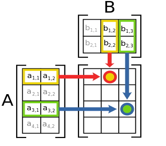

```{r setup, include=FALSE}
knitr::opts_chunk$set(echo = TRUE)
library(kableExtra)
```

#  {.tabset}

## Introduction

This guide pretends to give you some practical tools for applying the theory for your own specific research goals.
In each day we will have a time to have a sense about how coding in R for the relationships from the theory.
In a second part we will use `DemoKin` package for speeding up the pathway between ideas/questions and results.
With the first part you will have a notion of what is happening when you run functions in the second part, so you can customize your code for your own purpose if is necessary at some point.

Some useful things to know:

- Syllabus: sent by mail but can be found also in https://github.com/IvanWilli/matrix_kinship_course_lab/tree/main/syllabus.
- The required readings and course's slides can be downloaded from: https://www.dropbox.com/t/iM06GB0D5fXboWYu. See guidance from Hal in syllabus.
- Find this website's source code on GitHub: https://github.com/IvanWilli/matrix_kinship_course_lab/blob/main/docs/index.Rmd.
- Data for exercises can be found in previous dropbox folder or at https://github.com/IvanWilli/matrix_kinship_course_lab/tree/main/data.

This page will be *changing* during the workshop so don't be afraid if you see some movements, we are adapting content or fixing errors (hope not).

For the next 10 days we are kind of *course-related-non-biological-family*, so brother/sister: please reach us for any doubt.

We hope you enjoy it and be helpful.
Hands on.

Hal, Diego and Iván.

<!-- --------------------------------------------------------------------- -->

## Set up

### Initial settings

We will start soon the computer lab sessions, so would be great if in advance we have prepared the R environment.
First, you will need [R](https://www.r-project.org/) and [Rstudio](https://posit.co/download/rstudio-desktop/) installed.

Second, install the [DemoKin](https://github.com/IvanWilli/DemoKin) development version from GitHub (could take \~1 minute).
We made changes to the package ahead of this workshop If you had already installed the package, please uninstall it and and install it again.

```{r, eval=FALSE}
# remove.packages("DemoKin")
# install.packages("devtools")
devtools::install_github("IvanWilli/DemoKin", build_vignettes = TRUE)
```

Other packages that will be useful are:

```{r, eval=FALSE}
packages_needed <- c("tidyverse", "matrixcalc", "Matrix") 
packages_needed_nothaving <- packages_needed[!packages_needed %in% installed.packages()
for(lib in packages_needed_nothaving) install.packages(lib,dependencies=TRUE)
```

Packages in the `tidyverse` family will be very useful for summarize and visualizing results. Please load those libraries and please contact us in case some issues came up with this topic. Packages `matrixcalc` and `Matrix` will help us with some matrix operations.

Data for examples and exercises may come from UN population estimates and projections, using the [DataPortal API](https://population.un.org/dataportal/about/dataapi) from United Nations-Population Division, or from tables located in dropbox or github.

### Operations with vector and matrix in R

The intention of this section is to introduce some basic operators of matrices and vectors, in line with appendix A of @Caswell2001. There is a lot of online resources on matrix algebra with R ([here](https://www.taylorfrancis.com/books/mono/10.1201/9781315370200/basics-matrix-algebra-statistics-nick-fieller) a most comprehensive one), here we are going to show some relevant ones for our purposes. In case you have some experience with matrix operations in R, this won´t add you too much. See @Caswell2001 for mathematical details. 

- Creation

```{r}
a_vector <- c(1, 1, 1, 1)
a_vector
```

```{r}
same_vector <- rep(1, 4) # repeat a value!
same_vector
```

The function `matrix` needs a vector and the way it should be arranged by row and col.

```{r}
a_matrix <- matrix(1:8, nrow = 4, ncol = 4)
a_matrix
```

Identity matrix, a diagonal matrix with ones in the diagonal.
```{r}
identity_matrix <- diag(1, 4)
a_matrix %*% identity_matrix == a_matrix
```

- Dimensions

For matrices and vectors is a bit different:
```{r}
# with matrix:
dim(a_matrix)

# with vectors:
# dim(a_vector) gives error. 
# Vectors in R are dimensionless, don´t have a dimension by default but have a length. 
# Operationally it works as a column vector.
length(a_vector)
```

> Checking dimensions is a good practice for validate if two objects can be multiplied and in which order. You know something related to that is going on wrongly when you see this message "non-conformable arguments".

- Addition

```{r}
# needs same dimensions
other_vector <- rep(10, 4)
a_vector + other_vector
```

```{r}
other_matrix <- matrix(10, nrow = 4, ncol = 4)
a_matrix + other_matrix
```

- Multiplication

We´ll use this in *By hand* sections, and is used a lot inside `DemoKin`. Here a very intuitive figure multiplying $A$ by $B$ (dimensions 4x2 by 2x3 gets dimension 4x3): 




You can multiply a matrix by a another matrix, a vector with another vector, or a matrix with a vector. The symbol in R is the same for multiply scalars but surrounded by `%`.

```{r}
a_matrix %*% other_matrix
a_vector %*% other_vector
a_matrix %*% a_vector
```

Don´t confuse with the *Hadamard* product, the element by element operator,  which use the symbol `*`.

```{r}
a_matrix * other_matrix
a_vector * other_vector
```

- Determinant, inverse and eigendecomposition

Let´s create a square *non-singular* matrix (with no zero determinant, with inverse):
```{r}
set.seed(50)
other_matrix <- matrix(rpois(25, 3), 5, 5)
```

Determinant:
```{r}
det(other_matrix)
```

Inverse:
```{r}
solve(other_matrix)
```

Eigendecomposition:
```{r}
eigen_decomposition <- eigen(other_matrix)
eigen_values <- eigen_decomposition$values
eigen_vectors <- eigen_decomposition$vectors # left ones
eigen_values
eigen_vectors
```

- System of linear equations:

Linear algebra is useful for finding a vector $x$ that pre-multiplied by $A$ produce a vector $b$, in the form of a linear system of equations $Ax=b$, finding the solution as $x=A^{-1}b$ (see @Caswell2001 for details about when this have an unique, none or infinite solutions). As an example let´s solve this situation: *"I have 6 nephews and 10 nieces. My brothers have in average 1 son and 2 daughters and my sisters 1.5 sons and 2 daughters. How many brothers and sister do I have?"*. 

```{r}
b = c(6, 10) # I have 6 nephews and 10 nieces
A = matrix(c(1, 1.5, # My brother had in average 1 son and my sister 1.5
             2, 2),  # My brother had in average 2 daughters and my sister 2
          2, 2, byrow = T) # it´s a 2 by 2 matrix arranged by row
x = solve(A) %*% b # vector with brothers and sisters
```

Answer: I have `r x[1]` brothers and `r x[2]` sisters. 

> During the course we will try to name vectors and matrix with one or two letters maximum, vectors with lower case and matrix with upper case. 

### `dplyr` and `tidyr`

In some exercises we will have a long table with many variables and we will need to get indicators from that, like for example the mean age of daughters when Focal is 30 yo. `dplyr` and `tidyr` packages are really good for that. Let´s use `mtcars` data, getting the mean of `wt` by `cyl` and `am`, but later showing `am` categories in columns:

```{r}
head(mtcars)
```
```{r, message=F, warning=F}
library(dplyr)
library(tidyr)
mtcars %>% 
  summarise(mean_wt = mean(wt), .by = c(cyl, am)) %>% 
  pivot_wider(names_from = am, values_from = mean_wt)
```


These are the basic functions that we will use for showing examples. Check more on transforming data with [dplyr](https://dplyr.tidyverse.org/articles/programming.html) and reshaping with [tidyr](https://tidyr.tidyverse.org/articles/pivot.html) if you are curious. Finally the package [ggplot2](https://ggplot2.tidyverse.org/) will be used for visualize results. A very basic one:

```{r}
library(ggplot2)
mtcars %>% 
ggplot(aes(mpg, wt, colour = hp)) + 
  geom_point()
```

> In the exercises you can use the tools that you want!

<!-- ---------------------------------------------------------------------- -->

## Mon 8

During this section the idea is to have a sense of how translate theory of **Age-classified time-invariant one-sex kinship models** to code, how to use `DemoKin` package for that, and finally do some exercises.

### By hand

Imagine you are studying a female population with 5 ages (from 0 to 4) and fixed survival probabilities and fertility rates, given by:

```{r}
age <- 0:4
p <- c(.9, .7, .4, .1, 0)
f <- c(0, .2, .5, .3, 0)
```

> remember each age is a stage, so age 0 is the stage 1, age 1 is the stage 2, ...

Let´s build matrix $U$ and $F$. For R, the letter $F$ is reserved for `FALSE`, so can not use it as it is, in our case we add a point. Also we are going to use Hal´s letters for naming relatives, but when is a mtrix this will be in upper case.

```{r}
ages <- length(age)
U = F. <- matrix(0, nrow=ages, ncol=ages)
U[row(U)-1 == col(U)] <- p[-ages]
U[ages, ages] <- p[ages] # in this case is 0
F.[1,] <- f
```

Now find eigenvalues and eigenvectors for having the stable distribution by age $w$, and then the one for mothers $\pi$.

```{r}
A = U + F.
A_eigen = eigen(A)
A_eigen_value = as.double(A_eigen$values[1])
A_eigen_vector = as.double(A_eigen$vectors[,1])
w = A_eigen_vector/sum(A_eigen_vector)
pi = w*f/sum(w*f)
```

Let´s create matrix of dimension $5$x$5$ (or $\omega$x$\omega$ in general) to save the vectors of surviving kin by age (rows) in each Focal´s age (columns).

- mother

Starting with the **mother**, $\pi$ is the age distribution of mothers when Focal is just born. Remember every mother is alive a that moment.

```{r}
D <- matrix(0, 5, 5)
D[,1] <- pi  # eq 14 in Caswell (2019)
```

Let´s project that population (here the *key*, each kin is a population) and get the living mothers at each age of Focal, preserving the age´s kin too (that´s why we save results in column vector on the matrix).

```{r}
for(x in 2:ages){
  D[,x] <- U %*% D[,x-1]  # eq 13 in Caswell (2019) but in a matrix form
}
```

Each column-vector in $D$ is the vector $d(x)$ in equation 13 of @caswell_formal_2019: the distribution of living mothers by each Focal´s age. 

```{r}
D
```

If we sum up by columns (marginal), we get the expected living mothers for Focal when she grows up.  
```{r}
ones <- rep(1,ages)
d <- t(ones) %*% D # could be done with colSums(D)
plot(age, d, t = "b")
```

This is the general idea for all kin. Some are a bit different because includes subsidy, a second term in the projection loop.

- daughters

The case of relatives that born after Focal requires explicitly an additional matrix of subsidy.
Focusing on the **daughter** of Focal, initial living count by age is zero.

```{r}
A <- matrix(0, 5, 5) # eq 7 in Caswell (2019)
```

Let´s project that population, adding offspring from Focal at each age (the diagonal matrix $e$ is for that purpose, is tracking Focal´s age):

```{r}
e <- diag(1, ages)
for(x in 2:ages){
  # eq 6 in Caswell (2019) but in a matrix form
  A[,x] <- U %*% A[,x-1] + F. %*% e[,x] 
}
a <- t(ones) %*% A # could be done with colSums(A)
plot(age, a, t = "b")
```

Take a moment to see how $F. %*% e[,x]$ works. 

- sisters

The treatment is different depending if the sister born before or after Focal.

  - Older sisters: the initial distribution by age comes from the probability that Focal´s mother having a daughter at the time that Focal born, and then just survive (no subsidy).
  - Younger sisters: the initial amount is 0, and then the mother can give to Focal little sisters, that needs to survive with age too.

```{r}
M <- N <- matrix(0, 5, 5)
M[,1] <- A %*% D[,1] # eq 22
N[,1] <- 0           # eq 24
for(x in 2:ages){
  M[,x] <- U %*% M[,x-1]                 # eq 21 
  N[,x] <- U %*% N[,x-1] + F. %*% D[,x]  # eq 23
}
# lets group them directly
m_n <- t(ones) %*% (M + N)
```

- grandmother

What about the **grandmother**? "The age distribution of grandmothers at the birth of Focal is the age distribution of the mothers of Focal’s mother, at the age of Focal’s mother when Focal is born" (@caswell_formal_2019). In other words: What "portion" of mother remains alive for Focal´s mother when Focal born. We know that at Focal´s birth there was 1 mother with age distribution $\pi$. The distribution by age of her living mother can be obtained as $D %*% \pi$.

```{r}
G <- matrix(0, 5, 5)
G[,1] <- D %*% pi
```

Take a second to see what´s happening.

```{r}
for(x in 2:ages){
  G[,x] <- U %*% G[,x-1]
}
g <- t(ones) %*% G # or colSums(G)
```

Let´s visualize living kin by Focal´s age for the cases computed:

```{r}
plot(age, d, t = "b", ylab = "k")
lines(age, a, t = "b", col = 2)
lines(age, m_n, t = "b", col = 3)
lines(age, g, t = "b", col = 4)
legend("bottomright", c("m","d","s","gm"), col = 1:4, lty = 1)
```


That´s the kinship projection essence for one-sex, and pretty much for every variant that we will see.

In the `Demokin` package we have this automatized. Let´s take a look on how to use it.

### Using DemoKin

Load libraries:

```{r, warning=FALSE, message=FALSE}
library(DemoKin)
library(dplyr)
library(tidyr)
library(ggplot2)
```

#### 1. Built-in data

The `DemoKin` package includes data from Sweden as an example.
The data comes from the [Human Mortality Database](https://www.mortality.org/) and [Human Fertility Database](https://www.humanfertility.org/).

This is what the data of survival probabilities by age looks like:

```{r}
data("swe_px", package="DemoKin")
swe_px[1:5, 1:5]
```

It has year in columns and age in rows. And plotted $q_x$ ($´s complement) over age by time, looks like this:

```{r, warning=F, message=F}
swe_px %>% 
    as.data.frame() %>% 
    mutate(ages = 1:nrow(swe_asfr)-1) %>% 
    pivot_longer(-ages, names_to = "year", values_to = "px") %>%
    mutate(qx = 1-px) %>% 
    ggplot() + 
    geom_line(aes(x = ages, y = qx, col = year)) +
    scale_y_log10() + 
    theme(legend.position = "none")
```

And age-specific fertility rates:

```{r}
data("swe_asfr", package="DemoKin")
swe_asfr[1:5, 1:5]
```

Plotted over time and age:

```{r}
swe_asfr %>% as.data.frame() %>% 
     mutate(ages = 1:nrow(swe_asfr)-1) %>% 
     pivot_longer(-ages, names_to = "year", values_to = "asfr") %>%
     mutate(year = as.integer(year)) %>% 
     ggplot() + geom_tile(aes(x = year, y = ages, fill = asfr)) + 
     scale_x_continuous(breaks = seq(1900,2020,10), labels = seq(1900,2020,10))
```

#### 2. The function `kin()`

`DemoKin` can be used to compute the number and age distribution of Focal's relatives under a range of assumptions, including living and deceased kin.
The function `DemoKin::kin()` currently does most of the heavy lifting in terms of implementing the models. This is what it looks like in action, in this case assuming time-invariant demographic rates of 2015:

```{r}
# First, get vectors for a given year
swe_surv_2015 <- DemoKin::swe_px[,"2015"]
swe_asfr_2015 <- DemoKin::swe_asfr[,"2015"]
# Run kinship models
swe_2015 <- kin(p = swe_surv_2015, f = swe_asfr_2015, time_invariant = TRUE)
```

Main **arguments** are:

-   **p** numeric. A vector (atomic) or matrix of survival probabilities with rows as ages (and columns as years in case of matrix).
-   **f** numeric. Same as p but for age-specific fertility rates.
-   **time_invariant** logical. Assume time-invariant rates. Default TRUE.
-   **output_kin** character. kin types to return: "m" for mother, "d" for daughter, ...

Other relevant argument is **birth_female**, set as 1/2.04 by default. This multiplies `f` argument at some point, so in case you are using fertility rates already for female offspring, this parameter needs to be set to 1. 

Relatives for the `output_kin` argument are identified by a unique code.
Note that the relationship codes used in `DemoKin` differ from those in Caswell [-@caswell_formal_2019].
The equivalence between the two set of codes is given in the following table, so keep an eye on that in case some confusion:

```{r}
demokin_codes()
```

The output from `DemoKin::kin()` returns a list containing two data frames: `kin_full` and `kin_summary`. 
```{r}
str(swe_2015)
```

-   `kin_full` : This data frame contains expected kin counts by year (or cohort), age of Focal, and age of kin. The number of rows is because we have *14 kin types*, *101 Focal  ages* and *101 kin ages*. 

```{r}
head(swe_2015$kin_full)
```

-   `kin_summary` : This is a 'summary' data frame derived from `kin_full`. To produce it, we sum over all ages of kin to produce a data frame of expected kin counts by year or cohort and age of Focal (but *not* by age of kin). This is how the `kin_summary` object is derived:

```{r, message=F}
kin_by_age_Focal <- 
  swe_2015$kin_full %>% 
  group_by(cohort, kin, age_focal) %>% 
  summarise(count = sum(living)) %>% 
  ungroup()
# Check that they are identical (for living kin only here)
kin_by_age_Focal %>% 
  select(cohort, kin, age_focal, count) %>% 
  identical(
    swe_2015$kin_summary %>% 
      select(cohort, kin, age_focal, count = count_living) %>% 
      arrange(cohort, kin, age_focal)
  )
```

A lot of interesting data to explore. Take a moment to interpret what information is returned.

Let´s give more context with some possible research questions as an example. 

#### 3. Example: kin counts in time-invariant populations for Sweden 2015

Following Caswell [-@caswell_formal_2019], we assume a female closed population in which everyone experiences the Swedish 2015 mortality and fertility rates at each age throughout their life.
We then ask:

> How can we characterize the kinship network of an average member of the population (call her 'Focal')?

Let´s use the pre-loaded Swedish data and re-run model.

```{r}
# First, get vectors for a given year
swe_surv_2015 <- DemoKin::swe_px[,"2015"]
swe_asfr_2015 <- DemoKin::swe_asfr[,"2015"]
# Run kinship model
swe_2015 <- kin(U = swe_surv_2015, f = swe_asfr_2015, time_invariant = TRUE)
```

##### 3.2. Living kin

Now, let's visualize how the expected number of daughters, siblings, cousins, etc., changes over the lifecourse of Focal (now, with full names to identify each relative type using the function `DemoKin::rename_kin()`). Why some increase and other decrease in first ages? Which kin type increase in oldest ages and why?

```{r, fig.height=6, fig.width=8}
swe_2015$kin_summary %>%
  rename_kin() %>% 
  ggplot() +
  geom_line(aes(age_focal, count_living))  +
  theme_bw() +
  labs(x = "Focal's age") +
  facet_wrap(~kin)
```

<!-- For simplification fertility distribution by age is assumed with low dispersion, so mean age is representative of mother´s age when Focal born. If this is the case the mother´s plot would be the survival function conditioned to that age, that´s why its shape. For gm is the weighted avergae of conditioned ages depending pi-->

> You can think of the results as analogous to life expectancy (i.e., expected years of life for a synthetic cohort experiencing a given set of period mortality rates).

Next question: how does overall family size (and family composition) vary over life for an average woman at each age? Is there a pick in the total?

```{r}
swe_2015$kin_summary %>%
  select(age_focal, kin, count_living) %>% 
  rename_kin(., consolidate_column = "count_living") %>%
  ggplot(aes(x = age_focal, y = count)) +
  geom_area(aes(fill = kin), colour = "black") +
  labs(x = "Focal's age", y = "Number of living female relatives") +
  theme_bw() +
  scale_x_continuous(labels = seq(0, 100, 10), breaks = seq(0, 100, 10)) + 
  theme(legend.position = "bottom")
```

##### 3.3. Age distribution of living kin when Focal has some age

How old are Focal's relatives at some point´s of Focal´s life course? What soes she see when stop a moment of climbing over her diagonal-Lexis line? Using the `kin_full` data frame (with extended results), we can visualize the age distribution of Focal's relatives throughout Focal's life.
For example when Focal is 35, what are the ages of her relatives:

```{r, fig.height=6, fig.width=8}
swe_2015$kin_full %>%
  DemoKin::rename_kin() %>%
  filter(age_focal == 35) %>%
  ggplot() +
  geom_line(aes(age_kin, living)) +
  geom_vline(xintercept = 35, color=2) +
  labs(y = "Expected number of living relatives") +
  theme_bw() +
  facet_wrap(~kin)
```

Is coherent the mode of each kin distribution with Focal´s age? Make this bivariate comparison by intuition.

If we sum-up the density for each kin we woudl have totla living kin. Let´s visualize this living kin counts for a Focal woman aged 35 yo in a time-invariant population using a network or 'Keyfitz' kinship diagram [@Keyfitz2005] with the `plot_diagram` function. Take a moment to see what means each value.

```{r, fig.height=10, fig.width=12}
swe_2015$kin_summary %>% 
  filter(age_focal == 35) %>% 
  select(kin, count = count_living) %>% 
  plot_diagram(rounding = 2)
```


##### 3.4. Deceased kin

We have focused on living kin, but what about relatives who have died during her life?
The output of `kin` also includes information of kin deaths experienced by Focal. We did not see the code implementation in R, but it requires minimum additional modification to get the experienced death (basically implement equation 49 and 50 in @caswell_formal_2019, take a look to `DmeoKin` in any case or ask us). 
We start by considering the number of kin deaths that can expect to experience at each age.
In other words, the non-cumulative number of deaths in the family that Focal experiences at a given age. At which age Focal would experience more kin deaths? From what types?

```{r}
swe_2015$kin_summary %>%
  filter(age_focal>0) %>%
  group_by(age_focal, kin) %>% 
  summarise(count = sum(count_dead)) %>% 
  ungroup() %>% 
  rename_kin(., consolidate_column = "count") %>% 
  ggplot(aes(x = age_focal, y = count)) +
  geom_area(aes(fill = kin), colour = "black") +
  labs(x = "Focal's age", y = "Number of kin deaths experienced at each age") +
  coord_cartesian(ylim = c(0, 0.086)) +
  theme_bw() +
  theme(legend.position = "bottom")
```

<!-- waves are related to d(x) shape-->

Now, we combine all kin types to show the cumulative burden of kin death for an average member of the population surviving to each age:

```{r}
swe_2015$kin_summary %>%
  group_by(age_focal, kin) %>% 
  summarise(count = sum(count_cum_dead)) %>% 
  ungroup() %>% 
  rename_kin(., consolidate = "count") %>% 
  ggplot(aes(x = age_focal, y = count)) +
  geom_area(aes(fill = kin), colour = "black") +
  labs(x = "Focal's age", y = "Number of kin deaths experienced (cumulative)") +
  theme_bw() +
  theme(legend.position = "bottom")
```

A member of the population aged 15, 50, and 65yo will have experienced, on average, this burden of death experience (considering all kin type with same weight):
```{r}
swe_2015$kin_summary %>%
  group_by(age_focal) %>%
  summarise(count = sum(count_cum_dead)) %>%
  filter(age_focal %in% c(15, 50, 65))
```

We took a look on what we can do with `DemoKin`, based in matrix implementation from Hal Caswell´s papers. Let´s try some exercises.

### Exercises

> All exercises can be completed using datasets included in DemoKin.

#### E1. Kin availability and loss

Use `DemoKin` assuming time-invariant rates at the 1910 levels in Sweden and a female-only population to answer:

**E1.1**: What is the expected number of surviving offspring for an average woman aged 35?

```{r}
# Write your code here
```

**E3.2**: What is the expected number of surviving mother for an average woman aged 35?

```{r}
# Write your code here
```

**E3.3**: Plot 'Keyfitz' diagram for that woman and compare with the one from previous section.

```{r}
# Write your code here
```

**E1.4**: What is the cumulative number of offspring deaths experienced by an average woman who survives to age 65?

```{r}
# Write your code here
```

#### E2. Kin age distribution

Let´s back to Sweden 2015. The output of `DemoKin::kin` includes information on the average age of Focal's relatives (in the columns `kin_summary$mean_age` and `kin_summary$$sd_age`). For example, this allows us to determine the mean age, standar deviation and coefficient of variation of Focal's sisters over Focal´s lifecourse:

```{r, warning=F, message=F}
swe_2015$kin_summary %>%  
  filter(kin %in% c("os", "ys")) %>% 
  rename_kin() %>% 
  select(kin, age_focal, mean_age, sd_age) %>% 
  mutate(`sd_age/mean_age` = sd_age/mean_age) %>% 
  pivot_longer(mean_age:`sd_age/mean_age`) %>% 
  ggplot(aes(x = age_focal, y = value, colour = kin)) +
  geom_line() +
  facet_wrap(~name, scales = "free") +
  labs(y = "Mean age of sister(s)") +
  theme_bw()
```

Compute the the mean and SD of the age of Focal's sisters over the ages of Focal **by your own** (i.e., using the raw output in `kin_full`).
Plot separately (1) for younger and older sisters, (2) and for all sisters.

**E2.1**: get mean and SD of ages of sisters distinguishing between younger and older sisters:

```{r}
# Write your code here
```

**E2.2**: get ages of all sisters, irrespective of whether they are older or younger:

```{r}
# Write your code here
```

#### E3. By hand calculation

**E3.1**: use vectors $p$ and $f$ from toy example in *By Hand* section, but this time with `DemoKin`. Do you have same results? How many aunts have Focal during her life?

```{r}
age <- 0:4
p <- c(.9, .7, .4, .1, 0)
f <- c(0, .2, .5, .3, 0)
by_hand_example <- kin(p, f, birth_female = 1)
# by_hand_example$kin_summary[by_hand_example$kin_summary$kin == "m", "count_living"]
# by_hand_example$kin_summary[by_hand_example$kin_summary$kin == "d", "count_living"]
# by_hand_example$kin_summary[by_hand_example$kin_summary$kin == "m", "count_living"]
```


## Tues 9

During this section the idea is to have the sense of how translate theory of Age-classified time-**variant** one-sex kinship models to code, use `DemoKin` package and do some exercises.

### By hand

Let´s keep studying our a female population with 5 ages (from 0 to 4), but now survival probabilities improved 1% by year and fertility rates declined 1% by year, and I have only 10 years of data:

```{r}
age <- 0:4
years <- 10
p <- c(.9, .7, .4, .1, 0)
P <- sapply(1:years, function(t)p)
m <- c(0, .2, .5, .3, 0)
M <- sapply(1:years, function(t)m)
```

In this case we have the population too, so we can calculate empirical mother´s distribution by age:

```{r, eval=F}
# error
pop <- matrix(.2, ages, years)
Pi <- (pop * M) / (ones %*% (pop * M))
ones <- rep(1, ages)

(pop * M) %*% diag(1 / ones %*% (pop * M))

t(t(pop * M) / (ones %*% (pop * M))

mat <- pop * M
vec <- ones %*% (pop * M)

t(t(mat) / vec)

```

Let´s start again with mothers. Left boundary (previous to observed data) comes from stable population assumption. Boundary by age comes from observed $\pi$.
Remember that as a first step we need the mother distribution by age of Focal at every age. We saw yesterday that this is:

```{r}
m0 <- matrix(0, 5, 5)
pi <- matrix(c(0,.2,.5,.3, 0), 5, 10) # error!
m0[,1] <- pi[,1] # from stable assumption
for(x in 2:ages){
  m0[,x] <- U %*% m0[,x-1]
}
plot(age, m0[,1], t = "b")
lines(age, m0[,2], t = "b", col = 2)
lines(age, m0[,3], t = "b", col = 3)
lines(age, m0[,4], t = "b", col = 4)
lines(age, m0[,5], t = "b", col = 5)
legend("topright", c("0","1","2","3","4"), col = 1:5, lty = 1)
mt_list <- list()
mt_list[["0"]] <- m0
```


After 1 year, the mother of each Focal cohort will survive and Focal newborns would have mothers with $\pi(t+1)$. For t+1

```{r}
t = 1
m1 <- matrix(0, 5, 5)
m1[,1] <- pi[,t]
for(x in 2:ages){
  m1[,x] <- U[[1]] %*% m0[,x-1]
}
mt_list[["1"]] <- m1
```

For t+2...

```{r}
t = 2
m1 <- matrix(0, 5, 5)
m1[,1] <- pi[,t]
for(x in 2:ages){
  m1[,x] <- U[[2]] %*% m0[,x-1]
}
mt_list[["2"]] <- m1
```

At the end we will have living mothers by age for each Focal´s age, at each year.

```{r, eval = F}
for(t in 3:years){
mt <- matrix(0, 5, 5)
mt[,1] <- pi[,t]
  for(x in 2:ages){
    m[,x] <- U[[t]] %*% mt[[t-1]][,x-1]
  }
mt_list[[as.character(t)]] <- mt
}
```

### Using DemoKin


The demography of Sweden is, in reality, changing every year. This means that Focal and her relatives will have experienced changing mortality and fertility rates over time.
We account for this, by using the time-variant models introduced by Caswell and Song (2021).
Let's take a look at the resulting kin counts for a Focal born in 1960, limiting the output to the relative types given in the argument `output_kin`:

```{r, fig.height=6, fig.width=8}
swe_time_varying <-
  kin(
    p = swe_px,
    f = swe_asfr,
    n = swe_pop,
    time_invariant =FALSE,
    output_cohort = 1960,
    output_kin = c("d","gd","ggd","m","gm","ggm")
    )

swe_time_varying$kin_summary %>%
  DemoKin::rename_kin() %>%
  ggplot(aes(age_Focal,count_living,color=factor(cohort))) +
  scale_y_continuous(name = "",labels = seq(0,3,.2),breaks = seq(0,3,.2))+
  geom_line(color = 1)+
  geom_vline(xintercept = 35, color=2)+
  labs(y = "Expected number of living relatives") +
  facet_wrap(~kin,scales = "free")+
  theme_bw()

```

<!-- As you see the estimates stop at age 55, because no data is after 2015. -->

### 3. Kin deaths

Kin loss can have severe consequences for bereaved relatives. It can also affect the provision of care support and intergenerational transfers over the life course.
The function `kin` also includes information on the number of relatives lost by Focal during her life, stored in the column `count_cum_death`:

```{r, fig.height=6, fig.width=8, message=FALSE, warning=FALSE}
swe_time_varying$kin_summary %>%
  DemoKin::rename_kin() %>%
  ggplot() +
  geom_line(aes(age_Focal, count_cum_dead)) +
  labs(y = "Expected number of deceased relatives") +
  theme_bw() +
  facet_wrap(~kin,scales="free")
```

Given these population-level measures, we can compute Focal's the mean age at the time of her relative's death. For a Focal aged 50 yo:

```{r}
swe_time_varying$kin_summary %>%
  rename_kin() %>%
  filter(age_Focal == 50) %>%
  select(kin,count_cum_dead,mean_age_lost) %>%
  mutate_if(is.numeric, round, 2) %>%
  kable()
```


<!-- ## Wed 10 -->

<!-- During this section the idea is to have the sense of how translate theory of Age-classified time-**invariant** **two**-sex kinship models to code, use `DemoKin` package and do some exercises. -->

<!-- ### Exercise  -->

<!-- Diego's exercise copiar -  -->

<!-- ### By hand -->

<!-- Now our population has two sex, each of one has its own mortality and fertilty pattern, given by: -->

<!-- ```{r} -->
<!-- age <- 0:4 -->
<!-- p_female <- c(.9, .7, .4, .1, 0) -->
<!-- m_female <- c(0, .2, .5, .3, 0) -->
<!-- p_male <- c(.9, .6, .3, .05, 0) -->
<!-- m_male <- m_female * 1.1 -->
<!-- ``` -->

<!-- Let´s build the transition matrix for each sex. -->

<!-- ```{r} -->
<!-- ages = length(age) -->
<!-- # female -->
<!-- U_female = f_female = matrix(0, nrow=ages, ncol=ages) -->
<!-- U_female[row(U_female)-1 == col(U_female)] <- p_female[-ages] -->
<!-- U_female[ages, ages] = p_female[ages] -->
<!-- f_female[1,] = m_female -->
<!-- # male -->
<!-- U_male = f_male = matrix(0, nrow=ages, ncol=ages) -->
<!-- U_male[row(U_male)-1 == col(U_male)] <- p_male[-ages] -->
<!-- U_male[ages, ages] = p_male[ages] -->
<!-- f_male[1,] = m_male -->
<!-- ``` -->

<!-- Let´s build one that allow us to project a population vector with first 5 elements for female and last 5 for males, this is why we arrange block transition matrices in this way: -->

<!-- ```{r} -->
<!-- birth_female <- .5 -->
<!-- Ut <- Matrix::bdiag(U_female, U_male) %>% as.matrix() -->
<!-- ft <- rbind(cbind(birth_female * f_female,      birth_female * f_male), -->
<!--             cbind((1-birth_female) * f_female, (1-birth_female) * f_male)) -->
<!-- At <- Ut + ft -->
<!-- ``` -->
<!-- Let´s project some ficticious pop to see the arrangement: -->

<!-- ```{r} -->
<!-- fict_pop_females <- rnorm(5, 10, 3) -->
<!-- fict_pop_males <- rnorm(5, 10, 3) -->
<!-- fict_pop <- c(fict_pop_females, fict_pop_males) -->
<!-- At %*% fict_pop # still a cycle graph conected -->
<!-- ``` -->

<!-- But! we need Focal comes from the fertility from one of the parents, the mother: -->

<!-- ```{r} -->
<!-- ft_star <- matrix(0, nrow=ages, ncol=ages) -->
<!-- # the same offspring come from the mother only -->
<!-- ft_star <- rbind(birth_female * f_female, (1-birth_female) * f_female) -->
<!-- ``` -->

<!-- Now let´s find stable distribution by age $w$, and then the ones for parents $pi$, for each sex: -->

<!-- ```{r} -->
<!-- A_eigen = eigen(At) -->
<!-- A_eigen_value = as.double(A_eigen$values[1]) -->
<!-- A_eigen_vector = as.double(A_eigen$vectors[,1]) -->
<!-- w_female = A_eigen_vector[1:ages] -->
<!-- w_male = A_eigen_vector[c((ages+1):(ages*2))] # remember sex position -->
<!-- pi_female = w_female * m_female / sum(w_female * m_female) -->
<!-- pi_male = w_male * m_male / sum(w_male * m_male) -->
<!-- pi <- c(pi_female, pi_male) -->
<!-- ``` -->

<!-- We have the age distribution of parents when Focal born, and we need to project them as we did with the fictitious population. Warning: we are going to use the letter $m$ that comes from *mothers* in one-sex scenario just to keep the analogy between variants, but remember that here is for both parents: first mother second fathers column-oriented. -->

<!-- ```{r} -->
<!-- m <- matrix(0, ages*2, ages) -->
<!-- m[,1] <- pi -->
<!-- for(x in 2:ages){ -->
<!--   m[,x] <- as.matrix(Ut) %*% m[,x-1] -->
<!-- } -->
<!-- ones = rep(1,ages) # row vector by deafult -->
<!-- k_mothers <- ones %*% m[1:ages,] -->
<!-- k_fathers <- ones %*% m[-(1:ages),] -->

<!-- # how many living fathers and mothers has Focal during her life -->
<!-- plot(age, k_mothers, t = "b") -->
<!-- lines(age, k_fathers, t = "b", col = 2) -->
<!-- legend("topright", c("mother","father"), col = 1:2, lty = 1) -->
<!-- ``` -->

<!-- For projecting daughters we need to use $Ft$ so all comes from Focal, and need to use a modified version of $e$ inn the one-sex variant, tracking the age of Focal. -->

<!-- ```{r, eval=F} -->
<!-- phi <- matrix(0, ages*2, ages) -->
<!-- phi[1, 1] <- 1 -->
<!-- # G matrix moves Focal by age -->
<!-- G <- matrix(0, ages, ages) -->
<!-- G[row(G)-1 == col(G)] <- 1 -->
<!-- Gt <- bdiag(G, matrix(0, ages, ages)) %>% as.matrix() -->
<!-- Gt %*% phi -->
<!-- #inital -->
<!-- d <- matrix(0, ages*2, ages) -->
<!-- for(x in 2:ages){ -->
<!--   d[,x]   = Ut %*% d[,x-1] + ft %*% phi[,x-1] -->
<!--   phi[,x] = Gt %*% phi[,x-1] -->
<!-- } -->

<!-- k_daughter <- ones %*% d[1:ages,] -->
<!-- k_son <- ones %*% d[-(1:ages),] -->

<!-- # how many living fathers and mothers has Focal during her life -->
<!-- plot(age, k_daughter, t = "b") -->
<!-- lines(age, k_son, t = "b", col = 2) -->
<!-- legend("topleft", c("daughter","son"), col = 1:2, lty = 1) -->
<!-- ``` -->


<!-- ### Using DemoKin -->

<!-- Human males generally live longer and reproduce later than females.  -->
<!-- These sex-specific processes affect kinship dynamics in a number of ways.  -->
<!-- For example, the degree to which an average member of the population, call her Focal, has a living grandparent is affected by differential mortality affecting the parental generation at older ages.  -->
<!-- We may also be interested in considering how kinship structures vary by Focal's sex: a male Focal may have a different number of grandchildren than a female Focal given differences in fertility by sex.  -->
<!-- Documenting these differences matters since women often face greater expectations to provide support and informal care to relatives. -->
<!-- As they live longer, they may find themselves at greater risk of being having no living kin. -->
<!-- The function `kin2sex` implements two-sex kinship models as introduced by Caswell (2022).  -->
<!-- This vignette show how to run two-sex models and highlights some of the advantages of this model over one-sex models in populations with time-invariant and time-variant rates. -->

<!-- ```{r, message=FALSE, warning=FALSE} -->
<!-- library(DemoKin) -->
<!-- library(tidyr) -->
<!-- library(dplyr) -->
<!-- library(ggplot2) -->
<!-- library(knitr) -->
<!-- ``` -->

<!-- #### 1. Demographic rates by sex -->

<!-- Data on female fertility by age is less common than female fertility. Schoumaker (2019) shows that male TFR is almost always higher than female Total Fertility Rates (TFR) using a sample of 160 countries.  -->
<!-- For this example, we use data from 2012 France to exemplify the use of the two-sex function.  -->
<!-- Data on female and male fertility and mortality are included in `DemoKin`. In this population, male and female TFR is almost identical (1.98 and 1.99) but the distributions of fertility by sex varies over age: -->

<!-- ```{r} -->
<!-- fra_fert_f <- fra_asfr_sex[,"ff"] -->
<!-- fra_fert_m <- fra_asfr_sex[,"fm"] -->
<!-- fra_surv_f <- fra_surv_sex[,"pf"] -->
<!-- fra_surv_m <- fra_surv_sex[,"pm"] -->

<!-- sum(fra_fert_m)-sum(fra_fert_f) -->

<!-- data.frame(value = c(fra_fert_f, fra_fert_m, fra_surv_f, fra_surv_m), -->
<!--            age = rep(0:100, 4), -->
<!--            sex = rep(c(rep("f", 101), rep("m", 101)), 2), -->
<!--            risk = c(rep("fertility rate", 101 * 2), rep("survival probability", 101 * 2))) %>% -->
<!--   ggplot(aes(age, value, col=sex)) +  -->
<!--   geom_line() +  -->
<!--   facet_wrap(~ risk, scales = "free_y") +  -->
<!--   theme_bw() -->
<!-- ``` -->

<!-- #### 2. Time-invariant two-sex kinship models -->

<!-- We now introduce the functions `kin2sex`, which is similar to the one-sex function `kin` (see `?kin`) with two exceptions.  -->
<!-- First, the user needs to specify mortality and fertility by sex.  -->
<!-- Second, the user must indicate the sex of Focal (which was assumed to be female in the one-sex model). -->
<!-- Let us first consider the application for time-invariant populations: -->

<!-- ```{r} -->
<!-- kin_result <- kin2sex( -->
<!--   pf = fra_surv_f, -->
<!--   pm = fra_surv_m,  -->
<!--   ff = fra_fert_f,  -->
<!--   fm = fra_fert_m,  -->
<!--   time_invariant = TRUE, -->
<!--   sex_Focal = "f",  -->
<!--   birth_female = .5 -->
<!--   ) -->
<!-- ``` -->

<!-- The output of `kin2sex` is equivalent to that of `kin`, except that it includes a column `sex_kin` to specify the sex of the given relatives.  -->

<!-- Let's group aunts and siblings to visualize the number of living kin by Focal's age. -->

<!-- ```{r, message=FALSE, warning=FALSE} -->
<!-- kin_out <- kin_result$kin_summary %>%  -->
<!--   mutate(kin = case_when(kin %in% c("s", "s") ~ "s", -->
<!--                          kin %in% c("ya", "oa") ~ "a", -->
<!--                          T ~ kin)) %>% -->
<!--   filter(kin %in% c("d", "m", "gm", "ggm", "s", "a")) -->

<!-- kin_out %>%  -->
<!--   group_by(kin, age_Focal, sex_kin) %>% -->
<!--   summarise(count=sum(count_living)) %>% -->
<!--   ggplot(aes(age_Focal, count, fill=sex_kin))+ -->
<!--   geom_area()+ -->
<!--   theme_bw() + -->
<!--   facet_wrap(~kin) -->
<!-- ``` -->

<!-- **A note on terminology** -->

<!-- The function `kin2sex` uses the same codes as `kin` to identify relatives (see `demokin_codes()`). -->
<!-- Note that when running a two-sex model, the code 'm' refers to either mothers or fathers!  -->
<!-- Use the column `sex_kin` to determine the sex of a given relatives. -->
<!-- For example, in order to consider only sons and ignore daughters, use: -->

<!-- ```{r} -->
<!-- kin_result$kin_summary %>%  -->
<!--   filter(kin == "d", sex_kin == "m") %>%  -->
<!--   head() -->
<!-- ``` -->

<!-- Information on kin availability by sex allows us to consider sex ratios, a traditional measure in demography, with females often in denominator. The following figure, for example, shows that a 25yo French woman in our hypothetical population can expect to have 0.5 grandfathers for every grandmother:   -->

<!-- ```{r, message=FALSE, warning=FALSE} -->
<!-- kin_out %>%  -->
<!--   group_by(kin, age_Focal) %>% -->
<!--   summarise(sex_ratio=sum(count_living[sex_kin=="m"], na.rm=T)/sum(count_living[sex_kin=="f"], na.rm=T)) %>% -->
<!--   ggplot(aes(age_Focal, sex_ratio))+ -->
<!--   geom_line()+ -->
<!--   theme_bw() + -->
<!--   facet_wrap(~kin, scales = "free") -->
<!-- ``` -->

<!-- The experience of kin loss for Focal depends on differences in mortality between sexes.  -->
<!-- A female Focal starts losing fathers earlier than mothers.  -->
<!-- We see a slightly different pattern for grandparents since Focal's experience of grandparental loss is dependent on the initial availability of grandparents (i.e. if Focal's grandparent died before her birth, she will never experience his death). -->

<!-- ```{r, message=FALSE, warning=FALSE} -->
<!-- # sex ratio -->
<!-- kin_out %>% -->
<!--   group_by(kin, sex_kin, age_Focal) %>% -->
<!--   summarise(count=sum(count_dead)) %>% -->
<!--   ggplot(aes(age_Focal, count, col=sex_kin))+ -->
<!--   geom_line()+ -->
<!--   theme_bw() + -->
<!--   facet_wrap(~kin) -->
<!-- ``` -->

<!-- #### 3. Time-variant two-sex kinship models -->

<!-- We look at populations where demographic rates are not static but change on a yearly basis.  -->
<!-- For this, we consider the case of Sweden using data pre-loaded in `DemoKin`. -->
<!-- For this example, we will create 'pretend' male fertility rates by slightly perturbing the existing female rates.  -->
<!-- This is a toy example, since a real two-sex model should use actual female and male rates as inputs.  -->

<!-- ```{r} -->
<!-- years <- ncol(swe_px) -->
<!-- ages <- nrow(swe_px) -->
<!-- swe_surv_f_matrix <- swe_px -->
<!-- swe_surv_m_matrix <- swe_px ^ 1.5 # artificial perturbation for this example -->
<!-- swe_fert_f_matrix <- swe_asfr -->
<!-- swe_fert_m_matrix <- rbind(matrix(0, 5, years),   -->
<!--             swe_asfr[-((ages-4):ages),]) * 1.05 # artificial perturbation for this example -->

<!-- par(mfrow=c(1,2)) -->
<!-- plot(swe_surv_f_matrix[,"1900"], t="l", xlab = "Age", ylab = "Survival probability") -->
<!-- lines(swe_surv_m_matrix[,"1900"], col=2) -->
<!-- plot(swe_fert_f_matrix[,"1900"], t="l", xlab = "Age", ylab = "Fertility rate") -->
<!-- lines(swe_fert_m_matrix[,"1900"], col=2) -->
<!-- ``` -->

<!-- We now run the time-variant two-sex models (note the `time_invariant = FALSE` argument): -->

<!-- ```{r} -->
<!-- kin_out_time_variant <- kin2sex( -->
<!--                       pf = swe_surv_f_matrix,  -->
<!--                       pm = swe_surv_m_matrix, -->
<!--                       ff = swe_fert_f_matrix,  -->
<!--                       fm = swe_fert_m_matrix, -->
<!--                       sex_Focal = "f", -->
<!--                       time_invariant = FALSE, -->
<!--                       birth_female = .5, -->
<!--                       output_cohort = 1900 -->
<!--                       ) -->
<!-- ``` -->

<!-- We can plot data on kin availability alongside values coming from a time-invariant model to show how demographic change matters: the time-variant models take into account changes derived from the demographic transition, whereas the time-invariant models assume never-changing rates.  -->

<!-- ```{r, message=FALSE, warning=FALSE} -->
<!-- kin_out_time_invariant <- kin2sex( -->
<!--                       swe_surv_f_matrix[,"1900"], swe_surv_m_matrix[,"1900"],  -->
<!--                       swe_fert_f_matrix[,"1900"], swe_fert_m_matrix[,"1900"],  -->
<!--                       sex_Focal = "f", birth_female = .5) -->


<!-- kin_out_time_variant$kin_summary %>% -->
<!--   filter(cohort == 1900) %>% mutate(type = "variant") %>% -->
<!--   bind_rows(kin_out_time_invariant$kin_summary %>% mutate(type = "invariant")) %>%  -->
<!--   mutate(kin = case_when(kin %in% c("ys", "os") ~ "s", -->
<!--                          kin %in% c("ya", "oa") ~ "a", -->
<!--                          T ~ kin)) %>% -->
<!--   filter(kin %in% c("d", "m", "gm", "ggm", "s", "a")) %>% -->
<!--   group_by(type, kin, age_Focal, sex_kin) %>% -->
<!--   summarise(count=sum(count_living)) %>% -->
<!--   ggplot(aes(age_Focal, count, linetype=type))+ -->
<!--   geom_line()+ theme_bw() + -->
<!--   facet_grid(cols = vars(kin), rows=vars(sex_kin), scales = "free") -->
<!-- ``` -->

<!-- The assignment should be completed in groups that will be defined at the start of the course. **Make sure to read the instructions for the assignment in the syllabus:** https://github.com/alburezg/EDSD_2023_kinship_demography/EDSD_2023_kinship.pdf! -->

<!-- #### Description -->

<!-- You will use data on kinship structures [@kolk_swedish_2021] to benchmark formal models of kinship. -->

<!-- ```{r} -->
<!-- library(tidyverse) -->
<!-- ``` -->

<!-- ```{r} -->
<!-- kolk <- read.csv("../data/kolk_all_kin.csv", stringsAsFactors = F, skip = 3) -->
<!-- ``` -->

<!-- ```{r, fig.cap='Average number of kin for the entire 2017 population of Sweden according to Kolk et al. (2021) using data from population registers. Kin counts refer to female and male relatives.'} -->
<!-- levs <- c("grandchildren", "children", "nephews/nieces", "siblings",  -->
<!--           "cousins", "uncles/aunts", "grandparents") -->
<!-- kolk %>%  -->
<!--   mutate(kin = factor(kin, levels = levs)) %>% -->
<!--   ggplot(aes(x = cohort, y = mean, group = kin, fill = kin)) + -->
<!--   geom_area(colour = "black") + -->
<!--   scale_x_continuous(labels = function(x) paste0(x, "\n (", 2017 - x, ")")) + -->
<!--   labs( -->
<!--     y = "Mean number of kin (both sexes)" -->
<!--     , x = "Focal's Birth Cohort (Sweden, both sexes) \n (Age in 2017)" -->
<!--     ) + -->
<!--   theme_bw() + -->
<!--   theme(legend.position = "bottom") -->
<!-- ``` -->

<!-- The figure above shows the empirical distribution of kin for the 2017 population of Sweden based on registry data.  -->
<!-- Note that the figure includes female and male kin and that the sex of Focal is not specified (i.e., it is the average of all male and female individuals in the registers). -->
<!-- You can download the data to reproduce the fugure from: https://github.com/alburezg/EDSD_2023_kinship_demography/tree/main/data -->


<!-- #### Exercises -->

<!-- For this first exercise, you should use `DemoKin` to replicate this figure. Concretely: -->


<!-- - Run four iterations of the kinship model: -->

<!--    1. One-sex model; time-invariant rates; approximate male kin using GKP factors -->
<!--    1. One-sex model; time-variant rates; approximate male kin using the androgynous assumption (i.e., male fertility is equivalent to female fertility) -->
<!--    1. Two-sex model; time-invariant rates -->
<!--    1. Two-sex model; time-variant rates; assume demographic stability before 1968 -->

<!-- Some useful tips for the exercise: -->

<!--    - For details on methods to approximate two-sex models, see Caswell [-@caswell_formal_2022] -->
<!--    - To learn more about two-sex models in DemoKin, run `vignette("Reference_TwoSex", package = "DemoKin")`. If the vignette does not load, you may need to install the package as `devtools::install_github("IvanWilli/DemoKin", build_vignettes = TRUE)` -->
<!--    - Mortality data can be obtained from https://www.mortality.org/ -->
<!--    - Fertility data are available from https://www.humanfertility.org and (including for males) https://www.fertilitydata.org/ -->

<!-- Using the model outputs, answer: -->

<!--    1. How well do your models approximate the kin counts reported by Kolk et al. (2021)? Justify your answer using quantitative measures (max 250 words and 4 figures) -->
<!--    1. Based on this exercise, discuss the advantages and drawbacks of using formal models to quantify kinship (max 250 words) -->

<!-- ```{r} -->
<!-- # Write your code here -->
<!-- ``` -->

<!-- #### Handing in the assignment -->

<!-- Assignments (one per group) should be sent by email to the instructor **before midnight of Friday, April 28.**  -->
<!-- You should hand in the following files: -->

<!--   1. An .RMD file with all your code and answers to the exercise questions -->
<!--   1. A compiled .pdf of your markdown file showing all the code -->
<!--   1. All input data needed to replicate your code  -->

<!-- ## Thurs 11 -->

<!-- During this section the idea is to have the sense of how translate theory of **Stage-age-classified time-invariant one-sex kinship models** to code, use `DemoKin` package and do some exercises. -->

<!-- ### By hand -->

<!-- We keep studying the same female population but now we have access to their educational status, which makes differential fertility and mortality. This population has 2 stages in education ($s=2$), low and high. -->

<!-- ```{r} -->
<!-- age <- 0:4 -->
<!-- p_low <- c(.9, .6, .3, .05, 0) -->
<!-- p_high <- c(.9, .7, .4, .1, 0) -->
<!-- plot(age, p_low, t ="l") -->
<!-- lines(age, p_high, col=2) -->
<!-- legend("topright", c("low","high"), col = 1:2, lty = 1) -->
<!-- ``` -->
<!-- ```{r} -->
<!-- m_low <- c(0, .25, .6, .3, 0) -->
<!-- m_high <- c(0, .2, .5, .3, 0) -->
<!-- plot(age, m_low, t = "l") -->
<!-- lines(age, m_high, col=2) -->
<!-- legend("topright", c("low","high"), col = 1:2, lty = 1) -->
<!-- ``` -->
<!-- ### Usinf Demokin -->

<!-- `DemoKin` allows the computation of kin structures in a multi-state framework, classifying individuals jointly by age and some other feature (e.g., stages of a disease). For this, we need mortality and fertility data for each possible stage and probabilities of changing state by age. -->

<!-- Let's consider the example of Slovakia given by Caswell (2021), where stages are parity states.  -->
<!-- `DemoKin` includes the data to replicate this analysis for the year 1980: -->

<!-- - The data.frame `svk_fxs` is the fertility rate by age (rows) for each parity stage (columns). The first stage represents $parity=0$; the second stage, $parity=1$; and so on, until finally the sixth stage represents $parity\geq5$. -->
<!-- - The data.frame `svk_Hxs` has a similar structure but with $1$'s in the ages corresponding to newborns (the first age in our example).  -->
<!-- - The data.frame `svk_pxs` has the same structure and represents survival probabilities.  -->
<!-- - The list `svk_Uxs` has the same number of elements and ages (in this case 110, where $omega$ is 109). For each age, it contains a column-stochastic transition matrix with dimension for the state space. The entries are transition probabilities conditional on survival.  -->

<!-- Following Caswell (2020), we can obtain the joint age-parity kin structure: -->

<!-- ```{r} -->
<!-- # use birth_female=1 because fertility is for female only -->
<!-- demokin_svk1980_caswell2020 <-  -->
<!--   kin_multi_stage( -->
<!--     U = svk_Uxs, -->
<!--     f = svk_fxs, -->
<!--     D = svk_pxs, -->
<!--     H = svk_Hxs,  -->
<!--     birth_female=1 -->
<!--     ) -->
<!-- ``` -->

<!-- Note that the function ask for risks already in a certain matrix format. As an example, consider the age-parity distribution of aunts, when Focal is 20 and 60 yo (this is equivalent to Figure 4 in Caswell [2021]).  -->

<!-- ```{r, message=FALSE, warning=FALSE, fig.height=6, fig.width=10} -->
<!-- demokin_svk1980_caswell2020 %>%  -->
<!--   filter(kin %in% c("oa","ya"), age_Focal %in% c(20,60)) %>%  -->
<!--   mutate(parity = as.integer(stage_kin)-1, -->
<!--          parity = case_when(parity == 5 ~ "5+", T ~ as.character(parity)), -->
<!--          parity = forcats::fct_rev(parity)) %>%  -->
<!--   group_by(age_Focal, age_kin, parity) %>%  -->
<!--   summarise(count= sum(living)) %>%  -->
<!--   ggplot() + -->
<!--   geom_bar(aes(x=age_kin, y = count, fill=parity), stat = "identity") + -->
<!--   geom_vline(aes(xintercept = age_Focal), col=2) + -->
<!--   labs(y = "Number of aunts") + -->
<!--   theme_bw() + -->
<!--   facet_wrap(~age_Focal, nrow = 2) -->
<!-- ``` -->

<!-- We can also see the portion of living daughters and mothers at different parity stages over Focal's lie-course (this is equivalent to Figure 9 and 10 in Caswell [2021]).  -->

<!-- ```{r, message=FALSE, warning=FALSE, fig.height=6, fig.width=10} -->
<!-- demokin_svk1980_caswell2020 %>%  -->
<!--   filter(kin %in% c("d","m")) %>%  -->
<!--   mutate(parity = as.integer(stage_kin)-1, -->
<!--          parity = case_when(parity == 5 ~ "5+", T ~ as.character(parity)), -->
<!--          parity = forcats::fct_rev(parity)) %>%  -->
<!--   group_by(age_Focal, kin, parity) %>%  -->
<!--   summarise(count= sum(living)) %>%  -->
<!--   DemoKin::rename_kin() %>%  -->
<!--   ggplot() + -->
<!--   geom_bar(aes(x=age_Focal, y = count, fill=parity), stat = "identity") + -->
<!--   labs(y = "Kin count") + -->
<!--   theme_bw() + -->
<!--   facet_wrap(~kin, nrow = 2) -->
<!-- ``` -->

## References